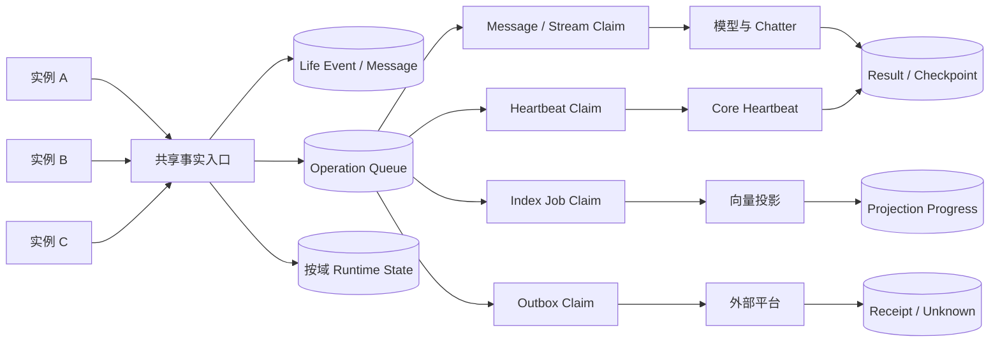

# Elysium 多后端共享数据库架构设计与实施规范

> 文档状态：设计评审稿。实施进度跟踪见 [`docs/operations/deployment_and_usage.md`](../operations/deployment_and_usage.md)「多后端共享数据库协议（实施状态）」。
>
> 适用范围：多个 Elysium 后端实例同时运行、连接同一个 MySQL、共同服务同一持续主体。
>
> 核心决策：保留 shared generation 与事务 fencing；取消 `life_engine.runtime_context/global` 的全局唯一写入者前提；将并发协调下沉到消息、stream turn、heartbeat operation、outbox action、索引任务等具体业务对象。
>
> 本文是实施规范，不代表生产实例已经切换。任何生产变更都必须经过维护窗口、备份、迁移、单实例冒烟和双实例验收。

---

## 1. 背景与问题陈述

Elysium 当前允许多个合法实例连接同一 MySQL generation，但 Life Engine 仍将大量运行状态序列化进单条记录：

```text
namespace = life_engine.runtime_context
state_key = global
```

现有保存路径具有以下特征：

1. 实例启动时读取完整 `global` payload 和 revision；
2. heartbeat、消息收集、Chatter 和关闭流程在进程内修改完整快照；
3. 保存时提交完整 payload，并要求数据库 revision 等于本地 `expected_revision`；
4. 冲突后不重新读取最新状态、不计算本地变更、不进行语义化合并；
5. 一个实例成功推进 revision 后，其他实例会长期持有陈旧 revision 并反复失败。

现场已经出现：

```text
expected=862
actual=865 -> 873 -> 879 -> 881 -> 882 -> 886
```

后续的心跳失败、消息收集失败、Chatter 游标保存失败和关闭持久化失败，均是同一陈旧快照冲突的级联结果。

远端后续加入了 generation-scoped singleton writer claim，用于阻止第二个实例写入 `runtime_context/global`。该实现能够避免两个实例互相覆盖，但会把系统重新限制为全局单写者，和“多个后端同时连接、同时工作、共享同一个 MySQL”的产品目标不一致。

因此需要重构的不是 MySQL 连接方式，而是 Elysium 的状态所有权、提交粒度、幂等协议和外部副作用恢复边界。

---

## 2. 设计目标

### 2.1 必须达成

1. 多个 Elysium 实例使用不同 `instance_id`，同时加入同一个 verified generation。
2. 多个实例可以同时写入共享 MySQL，不需要取得全局 Life Engine writer 租约。
3. 同一入站事件只形成一份权威事实；重复投递得到幂等结果。
4. 同一 stream 的 turn 保持顺序，不同 stream 可以并行。
5. 同一 heartbeat operation 只提交一次；失败不推进消费前沿。
6. 不同实例更新不同业务域时，不再竞争同一份完整 JSON 快照。
7. 一个实例崩溃后，未完成的具体 operation 可以被其他实例接管。
8. 飞书等外部发送有稳定 action identity、可审计状态和恢复路径。
9. Life Event、Memory、主体文件和原始经历不因并发重构被改写、覆盖或删除。
10. 新旧协议不能混写同一个正式 generation。

### 2.2 性能目标

1. 单条普通私聊增加的数据库协调开销应明显小于模型和平台网络耗时。
2. 数据库事务内不得执行模型调用、Embedding、平台 API、Chroma 或文件扫描。
3. 同一 stream 的顺序等待和异常数据库锁等待必须可区分。
4. 双实例处理不同 stream 时，总吞吐不得低于单实例基线；若下降，必须给出明确瓶颈证据。
5. 所有 claim、锁、重试和接管均有界，不允许无限等待或无限重试。

### 2.3 非目标

本次重构不承诺：

- 将同一 `chat_global` 模型链拆成无序并行；
- 让单条模型回复随实例数量线性加速；
- 依靠数据库实现外部平台绝对 exactly-once；
- 自动同步每台机器的本地 Chroma、workspace、媒体和配置；
- 通过最后写入者胜出、递归合并 JSON 或直接采用较大 revision 消除冲突；
- 在不中断旧 writer 的情况下热切换正式协议。

---

## 3. 不可破坏的项目不变量

### 3.1 主体连续性

- 机器、进程、provider、平台和 session 是运行边界，不是主体边界。
- 多实例共同服务同一持续主体，不得按机器生成不同 persona 或长期记忆谱系。
- 私有滚动上下文按意识实例和 stream 隔离，不能为“同步”直接互相复制完整内存快照。
- 跨实例协调必须经过带来源的 Life Event、operation、Presence、World Projection 或明确服务 Port。

### 3.2 权威历史

- 原始事件、Experience、claim、证据、解释、主体文档版本和回忆轨迹保持只追加。
- 同一 occurrence identity、相同内容是幂等重放；同一 identity、不同内容必须显式报冲突。
- 消费游标只有在对应工作完整成功后才能推进。
- 历史缺口不得通过取最大序列或跳到当前尾部掩盖。

### 3.3 主体文件主权

本重构不得由迁移程序创作、润色、合并或重写主体文件中的第一人称语义。数据库迁移只允许：

- 逐字节复制；
- 建立引用、hash、版本和 checkpoint；
- 重建技术投影；
- 保留变更前后可追溯证据。

### 3.4 投影边界

Chroma、FTS、摘要、runtime context、检索排序和健康统计均是投影。投影可以重建、降级或按节点独立维护，但不得反向覆盖权威历史。

---

## 4. 总体架构



目标架构分为五层：

1. **权威事实层**：不可变消息、Life Event、主体产生的结果、动作意图和审计证据。
2. **operation 层**：把“需要完成的具体工作”建模为稳定 identity 和状态机。
3. **细粒度协调层**：仅对具体 operation、stream、action 或 job 使用 claim/lease。
4. **按域状态层**：把不同更新频率、不同所有权和不同合并语义的运行态拆开。
5. **投影与外部副作用层**：Chroma 等可重建投影独立维护；外部发送通过 outbox 恢复。

核心原则：

> 共享数据库，但不共享一份由多个进程长期持有并整体覆盖的可变快照。

---

## 5. 保留、撤销与新增的机制

### 5.1 保留

#### Shared generation 与 authority fencing

继续校验：

```text
backend identity
generation id
authority epoch
authority token
schema/protocol version
```

它们回答“该实例是否有资格向当前 generation 写入”，不回答“该实例是否独占整个 Life Engine”。

#### 独立业务对象的 revision/CAS

Presence、Consciousness instance、主体文档 head、World Projection、Learning candidate 等具有明确业务 identity 的对象继续保留 revision/CAS。

#### 真正独占资源的局部 owner

以下场景仍可使用局部 claim：

- 一个具体 stream turn；
- 一条具体 outbox action；
- 一个索引 job；
- 一个设备控制 session；
- 一个 Voice/Live/Minecraft 具身连接；
- 一个不可并发占有的外部资源。

### 5.2 撤销

必须退出正式运行合同的是：

```text
life_engine.runtime_context/global 的 generation-scoped singleton writer
```

具体包括：

- 第二实例因为另一个 owner 持有 global claim 而启动失败；
- runtime context 每次写入必须携带 global singleton claim；
- 数据库 trigger 把 `global` 绑定成永久单写者资源；
- 把 revision 冲突直接升级成实例生命周期永久失败，而不读取最新状态。

退出 global singleton 不等于删除通用 claim 基础设施。通用 claim 应保留并用于具体业务对象。

### 5.3 新增

- 稳定的 deployment/instance/boot identity；
- operation identity 和状态机；
- message/stream/heartbeat/outbox/index 的细粒度 claim；
- runtime delta 或按域 mutation；
- operation receipt 与幂等提交；
- 发送 outbox；
- 每节点投影进度；
- 新旧协议启动门和配置 digest 校验。

---

## 6. 实例身份与兼容性

每个进程必须具有：

```text
deployment_id       稳定部署节点身份
instance_id          当前进程实例身份
boot_id              当前启动身份
owner_id             authority 审计来源
protocol_version     多实例协议版本
schema_generation    数据库 generation
config_digest        关键配置摘要
workspace_revision   workspace 内容版本
```

要求：

1. `instance_id` 在同一时刻全局唯一。
2. `boot_id` 每次启动变化，用于识别陈旧 claim。
3. claim 和 operation receipt 必须记录 owner identity，但不得记录密钥和正文。
4. 正式多实例节点必须通过关键配置兼容检查。
5. 模型 provider 可以按任务路由不同，但主体文件 revision、事件 schema、embedding 维度和核心协议必须满足已定义兼容合同。
6. 协议不兼容时 fail closed，不允许旧版本勉强加入。

---

## 7. 数据所有权矩阵

| 数据域               | 权威形态                     | 并发方式                      | 冲突处理                      |
| ----------------- | ------------------------ | ------------------------- | ------------------------- |
| Life Event        | append-only event        | occurrence 唯一写入           | 同 ID 异 hash 显式冲突          |
| 入站消息              | immutable message        | 平台 event ID 幂等            | 重放返回既有记录                  |
| stream turn       | operation + result       | 按 stream/turn claim       | 同一 turn 单 owner           |
| heartbeat         | operation + checkpoint   | 按 operation claim         | 已完成重试返回既有结果               |
| pending work      | 独立 work row              | 原子 claim/lease            | 过期后可接管                    |
| chatter cursor    | stream/consumer state    | frontier CAS              | 不倒退、不越过缺口                 |
| thought cursor    | stream/consumer state    | frontier CAS              | 不倒退、不越过缺口                 |
| 主体文档              | immutable version + head | version append + head CAS | 分叉显式保留                    |
| World Projection  | projection + frontier    | 连续前沿推进                    | 缺口停止                      |
| Memory index job  | job row                  | 原子 claim/lease            | 幂等完成、失败可重放                |
| 外部发送              | outbox action            | action claim              | sent/unknown/retryable 分离 |
| Chroma/FTS        | projection               | 每节点或共享服务                  | 从权威历史重建                   |
| 过渡 global context | checkpoint + delta       | 最新读取后应用 delta             | 不可解释时拒绝                   |

---

## 8. Runtime Context 重构

### 8.1 当前 full snapshot 的问题

当前 payload 混合：

- heartbeat_count；
- event_sequence；
- heartbeat_context_cursor；
- subconscious_summary；
- 最近模型结果和错误；
- wake/external/tell 时间；
- self pause 状态；
- chatter context/thought cursor；
- pending_events；
- event_history。

这些字段具有不同的所有权和合并语义。将它们一起覆盖，意味着任意字段变化都会使整份 payload revision 失效。

### 8.2 过渡期接口

现有接口：

```python
put_state(
    namespace="life_engine.runtime_context",
    state_key="global",
    expected_revision=local_revision,
    payload=full_payload,
)
```

目标过渡接口：

```python
commit_runtime_delta(
    namespace="life_engine.runtime_context",
    state_key="global",
    operation_id=operation_id,
    base_revision=observed_revision,
    delta=typed_delta,
    actor=actor,
    source=source,
)
```

### 8.3 提交算法

```text
事务外：
  1. 基于已读取状态完成业务计算
  2. 生成 typed delta 和稳定 operation_id

短事务内：
  3. 验证 shared-generation authority
  4. SELECT 当前 checkpoint/state FOR UPDATE
  5. 查询 operation receipt
  6. 若 operation 已提交，返回既有 receipt
  7. 读取最新 state/revision/frontier
  8. 按 delta 类型验证前置条件
  9. 应用 delta；不可合并则显式冲突
 10. 写入新 state/revision
 11. 写入 operation receipt
 12. COMMIT

事务提交后：
 13. 更新本进程 confirmed revision/frontier
 14. 唤醒后续 operation
```

### 8.4 Delta 类型

建议最小集合：

```text
append_event
append_pending_message
claim_stream_turn
commit_stream_turn
advance_stream_cursor
advance_thought_cursor
append_heartbeat_result
set_pause_checkpoint
set_technical_projection
append_failure_evidence
```

每个 delta 必须包含：

```text
operation_id
schema_version
actor
source
causation_id
payload_hash
stream_id / consciousness_instance_id（适用时）
base_frontier（适用时）
created_at
```

禁止提供通用的：

```text
set_any_json_field(path, value)
```

否则会重新引入无语义覆盖。

### 8.5 合并规则

#### 可自动合并

- 不同 identity 的 append-only event：并集；
- 同 identity、同 hash：幂等；
- 独立 stream 的 cursor：各自更新；
- 独立 operation 的结果引用：各自追加；
- 技术计数：使用数据库原子增量或 operation 去重后的派生结果。

#### 不能自动合并

- 同 identity、不同 payload hash；
- cursor 前沿中存在缺口；
- 两个结果声称完成同一 operation，但 digest 不同；
- 主体文档从同一 parent 产生不同 head；
- 需要判断主观意义、事实真伪或价值优先级的内容。

发生不可合并冲突时必须：

1. 保留双方内容和来源；
2. 写入 conflict evidence；
3. 不推进相关 cursor/checkpoint；
4. 将 operation 标记为 conflict；
5. 交由主体反思或独立评估者裁决，不由基础设施代判。

### 8.6 长期拆分

过渡稳定后，将 `global` 拆为：

```text
life_engine.heartbeat:<consciousness_instance_id>
life_engine.pending:<stream_id>
life_engine.chatter_cursor:<stream_id>:<consumer_id>
life_engine.thought_cursor:<stream_id>:<consumer_id>
life_engine.pause:<consciousness_instance_id>
life_engine.projection:<projection_name>:<node_id>
life_engine.sync:<consumer_id>
```

`global` 最终只保留无法按独立业务 identity 拆分的技术 checkpoint，不再保存完整 history 和所有 stream cursor。

---

## 9. 入站消息与 Stream Turn

### 9.1 消息事实

建议字段：

```text
message_id
platform
platform_event_id
occurrence_id
payload_hash
stream_id
reply_target
source
occurred_at
received_at
raw_payload_ref
```

唯一约束：

```text
UNIQUE(platform, platform_event_id)
UNIQUE(source, occurrence_id)
```

相同 identity、相同 hash 是幂等重放；相同 identity、不同 hash 进入冲突表，不允许静默覆盖。

### 9.2 Stream Turn Operation

```text
turn_id
stream_id
stream_sequence
source_message_id
status
claim_owner
claim_epoch
lease_until
input_frontier
result_ref
result_digest
attempts
created_at
updated_at
```

状态机：

```text
pending
  -> claimed
  -> processing
  -> completed
  -> retryable
  -> failed
  -> conflict
  -> unknown
```

### 9.3 顺序合同

- 不同 stream 可以由不同实例并行处理。
- 同一 stream 同一时刻只允许一个可提交 turn owner。
- 后续消息可以先写入事实层，但不能越过未完成 turn 推进滚动上下文。
- claim 过期后，新 owner 必须从已提交 checkpoint 恢复。
- 旧 owner 即使迟到完成，也必须因 claim epoch/fencing 不匹配而被拒绝提交。

### 9.4 模型调用边界

模型调用必须位于数据库事务外：

```text
短事务认领 turn
-> 事务外构建上下文与调用模型
-> 短事务提交 turn result
```

任何实现都不得在持有 `FOR UPDATE` 行锁期间等待模型响应。

---

## 10. Heartbeat Operation

### 10.1 不使用全局永久 leader

本方案不要求某台机器长期拥有整个 Life Engine。Heartbeat 被建模为具体、可认领、可审计的 operation：

```text
heartbeat_operation_id
consciousness_instance_id
sequence
input_frontier
prepared_context_digest
status
claim_owner
claim_epoch
lease_until
model_request_id
result_ref
result_digest
committed_frontier
```

### 10.2 执行流程

1. 实例发现下一轮待处理 heartbeat operation。
2. 短事务按 operation identity 认领。
3. 事务外准备上下文并调用 `model_tasks.core`。
4. 短事务校验 claim epoch、input frontier 和当前 operation 状态。
5. 写入结果引用和 checkpoint。
6. operation 已完成时，重试返回既有结果，不再次调用模型。
7. 失败不推进 heartbeat 消费前沿。

### 10.3 严格顺序

如果 `chat_global` 的 heartbeat 必须单序列，则约束键是：

```text
(consciousness_instance_id, heartbeat_sequence)
```

这意味着同一序列的具体工作只有一个 owner，但不会阻止其他实例：

- 接收入站消息；
- 写 Life Event；
- 处理不同 stream；
- 执行索引任务；
- 执行其他 consciousness instance 的 operation。

---

## 11. 外部副作用与 Outbox

### 11.1 必要性

当前存在危险窗口：

```text
平台发送成功
-> 本地 delivered/context 持久化失败
-> 重启后无法确定是否已发送
```

多实例环境中，另一个实例可能重试并造成重复发送。因此平台发送不能只依赖 runtime context。

### 11.2 Outbox Schema

```text
action_id
idempotency_key
source_event_id
stream_id
target
payload_ref
payload_hash
status
claim_owner
claim_epoch
lease_until
provider_request_id
provider_receipt_id
attempts
last_error_type
created_at
updated_at
```

### 11.3 状态语义

```text
pending     已记录意图，未认领
claimed     已被实例认领
sending     正在调用平台
sent        平台成功且回执已持久化
retryable   明确未成功，可安全重试
failed      明确不可重试
unknown     平台结果不确定，禁止盲目重发
```

### 11.4 规则

- 先在数据库中落 action intent，再允许平台发送。
- 同一个 `action_id` 同时只能有一个 claim owner。
- 平台支持幂等键时必须传稳定 key。
- 平台不支持幂等时，`unknown` 必须保留并进入核对流程。
- 发送成功不能因 runtime context 冲突被回滚成“未发送”。
- outbox 记录不得包含未加保护的密钥；正文可使用受权限控制的 payload reference。

---

## 12. Memory、索引与本地 Chroma

### 12.1 权威关系

```text
Life Event / Experience / Document Version
    -> Memory Index Job
    -> Chroma / FTS / Chunk Projection
```

前者是权威历史，后者是可重建投影。

### 12.2 索引任务

Memory index job 支持多 worker，但必须使用数据库原子认领：

```text
job_id
source_identity
source_revision
projection_target
status
claim_owner
claim_epoch
lease_until
attempts
last_error
```

一个实例完成 MySQL 中的 job，不能自动代表其他实例的本地 Chroma 已经拥有对应向量。

### 12.3 短期方案：每实例投影

每个节点记录：

```text
projection_node_id
collection_identity
source_frontier
embedding_model
embedding_dimension
workspace_revision
last_success_at
backlog
status
```

优点：改动较少，节点离线仍可本地检索。

缺点：

- 每台机器重复 Embedding；
- 投影进度和检索结果可能短暂不同；
- 接管请求时必须检查节点 readiness。

### 12.4 长期方案

按优先级选择：

1. 共享向量服务；
2. 共享 workspace + 每实例独立投影；
3. 请求固定路由到具备对应本地投影的节点。

无论哪种方案，都必须保留从权威历史重建的能力。

---

## 13. 本地文件、媒体与配置

MySQL 共库不会自动共享：

- `data/life_engine_workspace`；
- 主体文件实例；
- 媒体文件；
- Chroma；
- 插件本地配置；
- 本地模型和音色资产；
- 缓存与临时文件。

多实例正式运行前必须明确：

### Workspace

- 使用同一内容 revision；
- 启动时比较 workspace manifest/hash；
- 差异时标记不兼容或降级，不允许各自扫描不同主体文件并共同写入同一权威状态。

### 媒体

- 使用共享对象存储、网络文件系统或内容寻址复制；
- 数据库保存稳定 media identity，不保存只能由某一台机器解析的裸绝对路径作为唯一引用。

### 配置

启动 readiness 至少核对：

```text
protocol version
schema generation
workspace revision
embedding model/dimension
关键插件能力 digest
主体模型版本包 identity（适用时）
```

配置不一致必须显式报告，不得静默作为同一能力节点接流量。

---

## 14. 数据库表与索引草案

本节是逻辑草案，实施前必须结合当前 migration 框架确定最终命名和字段类型。

### 14.1 operations

```text
operation_id PK
operation_type
scope_key
sequence
status
claim_owner
claim_epoch
lease_until
input_frontier_json
result_ref
result_sha256
attempts
created_at
updated_at
```

建议索引：

```text
UNIQUE(operation_id)
INDEX(operation_type, status, lease_until)
UNIQUE(operation_type, scope_key, sequence)
```

### 14.2 operation_receipts

```text
operation_id PK
commit_revision
result_sha256
committed_by
committed_at
```

用于幂等提交，防止同一 operation 重复应用 delta。

### 14.3 runtime_deltas

```text
delta_id PK
operation_id
namespace
state_key
delta_type
schema_version
payload_json
payload_sha256
actor
source
causation_id
created_at
```

建议：

```text
UNIQUE(operation_id, delta_type)
INDEX(namespace, state_key, created_at)
```

### 14.4 outbox_actions

使用第 11 节字段，并增加：

```text
UNIQUE(action_id)
UNIQUE(idempotency_key)
INDEX(status, lease_until)
INDEX(stream_id, created_at)
```

### 14.5 projection_progress

```text
projection_name
projection_node_id
source_frontier
source_digest
config_digest
status
last_success_at
backlog
PRIMARY KEY(projection_name, projection_node_id)
```

---

## 15. 事务、锁与重试

### 15.1 允许的事务内容

- authority/fencing 校验；
- claim 获取、续约和释放；
- 当前 row/frontier 读取；
- operation 状态转换；
- typed delta 应用；
- receipt/outbox 写入；
- cursor/checkpoint 提交。

### 15.2 禁止的事务内容

- LLM 调用；
- Embedding；
- 飞书/QQ/B 站等平台 API；
- Chroma；
- 本地文件扫描；
- TTS、ASR、媒体转码；
- 无界阻塞 I/O。

### 15.3 锁顺序

所有需要多行锁的事务必须固定顺序，例如：

```text
authority generation
-> operation
-> scope state
-> operation receipt
-> outbox
```

禁止不同代码路径使用相反顺序。

### 15.4 重试

仅允许对可识别的短暂工程错误有限重试：

- deadlock；
- lock wait timeout；
- 短暂连接错误；
- claim race；
- revision 改变但 delta 可重新验证。

禁止：

- 对不可合并语义冲突自动重试到覆盖成功；
- 对外部发送 `unknown` 直接重发；
- 对模型结果提交失败无条件再次调用模型；
- 无限重试刷日志。

---

## 16. Singleton Writer 安全退场

当前 singleton claim、binding 和 trigger 已经进入代码/远端技术 schema。不能只删除 Python 调用，否则数据库 trigger 可能继续拒绝写入；也不能先删 trigger 再继续运行旧 full-snapshot writer，否则会重新暴露覆盖风险。

### 16.1 准备阶段

1. 引入新的 `multi_writer_protocol_version`。
2. 新代码同时支持读取旧 checkpoint，但只通过新 operation/delta 路径写入。
3. 增加启动只读检查，识别 global singleton trigger/claim 状态。
4. 为新协议创建隔离 namespace 和随机 operation 合同测试。
5. 禁止正式外部发送参与影子测试。

### 16.2 维护窗口

1. 用户手工停止所有旧 Elysium 实例。
2. 确认没有旧实例、容器或其他机器继续写正式数据库。
3. 备份 runtime、claim、binding、trigger、Life Event、Memory 和相关 migration 表。
4. 记录文件权限、大小和 SHA-256。
5. 导出 `runtime_context/global` 的 revision、payload hash 和更新时间。
6. 创建 operation/delta/outbox/projection schema。
7. 将现有 global payload 原样封装为初始 checkpoint，不改写主体语义。
8. 解除 `runtime_context/global` 的 singleton binding/trigger 要求。
9. 保留通用 claim 表和局部 claim 功能。
10. 提高正式 generation/protocol version，阻止旧版重新加入。

### 16.3 激活顺序

1. 启动一个新协议实例；
2. 完成只读加载、随机 namespace 写入和关闭冒烟；
3. 完成正式单实例消息、heartbeat、Memory 和 outbox 冒烟；
4. 启动第二个新协议实例；
5. 执行双实例契约测试；
6. 双实例真实验收通过后才允许扩大实例数。

---

## 17. 分阶段实施计划

### 阶段 0：协议冻结与字段审计

交付：

- `runtime_context/global` 字段清单；
- 每个字段的 authority、owner、merge contract 和迁移目标；
- operation/claim/outbox schema；
- singleton trigger 退场脚本设计；
- 单实例性能基线；
- 双实例测试矩阵。

退出门：任何字段都不能以“先递归合并，出问题再说”进入开发。

### 阶段 1：多实例基础身份与 operation

交付：

- deployment/instance/boot identity；
- operation store；
- claim/lease 通用状态机；
- operation receipt；
- content-free 健康与审计。

退出门：两个实例能在隔离 namespace 认领不同 operation；同一 operation 只有一个 owner；过期后可接管。

### 阶段 2：Runtime Delta 过渡层

交付：

- typed delta；
- 最新状态读取与短事务提交；
- 幂等 receipt；
- 本地 confirmed revision/frontier 更新合同；
- global singleton claim 解耦代码路径。

退出门：两个 writer 同时提交不相交 delta，最终双方结果均保留；同 operation 重放不重复；不可合并冲突显式保留。

### 阶段 3：消息与 Stream

交付：

- 入站消息唯一 identity；
- stream turn operation；
- per-stream claim；
- Chatter cursor 拆分；
- 同 stream 顺序与跨 stream 并行。

退出门：双实例收到同一消息只产生一个处理结果；不同 stream 可以并行；owner 崩溃后可接管。

### 阶段 4：Heartbeat

交付：

- heartbeat operation；
- input frontier；
- model request/result identity；
- checkpoint 提交；
- 迟到旧 owner fencing。

退出门：同一 heartbeat 不重复提交；模型失败不推进 frontier；接管后保持序列连续。

### 阶段 5：Outbox

交付：

- 平台发送 action；
- outbox worker；
- provider request/receipt；
- unknown 恢复合同；
- 飞书适配器接入。

退出门：发送成功后本地提交前崩溃可以诊断；同 action 不被无审计重复发送。

### 阶段 6：Memory 与本地投影

交付：

- index job 多 worker claim；
- per-node projection progress；
- Chroma readiness；
- workspace/media/config digest。

退出门：一台完成索引不再伪装所有节点完成；节点接管前能判断本地投影是否可用。

### 阶段 7：正式迁移与扩容

按单实例新协议、双实例、三实例、四实例顺序扩大。每扩大一档都重新采集性能和正确性证据。

---

## 18. 回滚策略

### 18.1 原则

- 回滚不能删除已追加事实。
- 回滚不能用旧 full snapshot 覆盖新协议已经产生的 operation/delta。
- 新旧版本不能同时写同一个 generation。
- 无法证明无损时，只允许停止新写入并进入只读诊断，不允许猜测性恢复。

### 18.2 阶段内回滚

阶段 1～2 尚未正式切流时：

- 保留新表；
- 禁止正式业务写入新协议；
- 旧正式运行不受影响。

正式切流后：

1. 停止新协议写入来源；
2. 保存 operation、delta、outbox 和冲突证据；
3. 从最后 confirmed checkpoint 构建只读投影；
4. 评估旧版是否能安全读取；
5. 若新协议已产生旧版无法表达的数据，不允许回旧版写入；
6. 修复后从权威事实重放恢复。

### 18.3 不允许的回滚

- 直接删 operation/delta 表；
- 把数据库恢复到迁移前而忽略迁移后真实事件；
- 把未确认外部发送当作未发送；
- 清空 Chroma 后反向删 Memory 权威记录；
- 用另一个实例的内存快照覆盖数据库。

---

## 19. 性能影响与预算

### 19.1 单条消息

新增路径通常包括：

```text
消息幂等写入
-> turn claim
-> 读取 stream checkpoint
-> 模型调用
-> 提交 result/delta
-> outbox 写入/认领
-> 平台发送
-> receipt
```

相比当前单终端，会增加若干短 SQL 往返。只要数据库网络正常、事务足够短，该开销通常远小于模型和平台 API 的秒级耗时。

预期效果：

- 单条低负载私聊：略慢；
- 用户体感：通常不明显；
- 同一 stream 连续消息：仍需排队，可能略慢；
- 不同 stream 并发：吞吐提高、尾延迟更稳定；
- 实例故障：从人工重启变为有界接管。

### 19.2 数据库负载

会增加：

- claim/lease SQL；
- operation receipt；
- outbox 状态更新；
- 按域 state 读取/提交；
- readiness 和 projection progress。

会减少：

- 完整大 JSON 的重复序列化与传输；
- 无关字段导致的 revision 冲突；
- 冲突后的连续失败日志；
- 多节点重复处理同一 operation。

### 19.3 必须测量

```text
single instance p50/p95/p99
2 instances p50/p95/p99
same-stream queue delay
cross-stream throughput
DB query count per message
lock wait time
deadlock/retry count
claim acquisition latency
claim takeover latency
model calls per occurrence
duplicate send count
outbox unknown duration
projection backlog per node
```

### 19.4 初始验收预算

以下是工程验收建议，不是未经实测的性能承诺：

- 普通私聊新增数据库协调耗时不超过现有端到端 P95 的 10%；
- 同 stream 正常排队必须与异常锁等待分开展示；
- 双实例不同 stream 总吞吐不低于单实例；
- 所有短事务不含外部 I/O；
- lock wait、deadlock、claim retry 有上限并可观测；
- 单 occurrence 的模型调用次数不得因重复投递无故增加。

---

## 20. 可观测性与健康检查

每条 operation 相关日志至少包含：

```text
instance_id
boot_id
operation_id
operation_type
scope_key
claim_epoch
stream_id（适用时）
occurrence_id（适用时）
result/transition
retry_count
```

健康检查应区分：

```text
ready
not_ready
degraded
failed
disabled
```

并报告：

- generation/protocol compatibility；
- 当前持有的局部 claim 数；
- 过期 claim；
- pending/retryable/unknown operation；
- outbox backlog；
- projection readiness；
- 最近成功提交时间；
- 锁等待和死锁计数。

不得输出：

- authority token；
- claim token；
- 数据库密码；  
  -平台密钥；  
  -私人消息正文；  
  -主体文件原文。

---

## 21. 测试矩阵

### 21.1 存储与协议

- 两个 owner 加入同一 shared generation；
- 错 generation/epoch/token 继续 fail closed；
- global runtime 不再要求 singleton claim；
- 局部 claim 仍拒绝第二 owner；
- operation claim 原子性；
- lease 过期接管；
- 旧 owner 迟到提交被 fencing 拒绝；
- operation receipt 幂等；
- 不相交 delta 合并；
- 同 identity 异 hash 冲突；
- deadlock、1205、连接取消和 rollback 恢复。

### 21.2 消息与 Stream

- 同一平台 event 同时投递两个实例；
- 同 occurrence 同 hash；
- 同 occurrence 异 hash；
- 同一 stream 两条连续消息；
- 不同 stream 并行；
- 模型调用前、调用中、提交前 owner 崩溃；
- 未完成 turn 不推进 cursor；
- 迟到结果不覆盖已完成 turn。

### 21.3 Heartbeat

- 同一 heartbeat operation 双实例竞争；
- 模型请求完成后提交前崩溃；
- 重试返回已完成结果；
- 失败不推进 input frontier；
- 接管后 sequence 连续；
- 新 Life Event 在模型运行期间留给下一轮。

### 21.4 Outbox

- action 双实例竞争；
- 发送前崩溃；
- 发送后 receipt 前崩溃；
- 平台明确失败；
- 平台超时结果未知；
- stable idempotency key；
- 同 action 不重复产生业务发送。

### 21.5 Memory 与投影

- 两节点各自投影进度；
- 一节点完成不能使另一节点伪完成；
- Embedding 配置不一致拒绝 readiness；
- Chroma 损坏后从权威历史重建；
- workspace revision 不一致显式降级；
- artifact recovery 重放幂等。

### 21.6 生命周期

- 重复启动；
- 部分初始化失败；
- shutdown 只释放本实例 claim；
- 另一个实例仍可继续工作；
- 旧版本加入新 generation 被拒绝；
- 新协议迁移回滚演练。

---

## 22. 生产验收门

只有以下条件全部满足，才能宣称支持生产多实例：

1. `runtime_context/global` singleton claim/trigger 已受控退场。
2. 旧版本无法加入正式新协议 generation。
3. 两个不同 `instance_id` 可以同时启动并保持 ready。
4. 双实例提交不相交 runtime delta，双方结果均保留。
5. 同一入站事件只有一份权威事实和一个有效处理结果。
6. 同一 stream 保持顺序，不同 stream 可并行。
7. Heartbeat operation 不重复提交，失败不推进 frontier。
8. 飞书发送通过 outbox 验收，结果未知不被盲目重发。
9. 关闭一个实例后，另一个实例仍能接收新消息。
10. 过期 operation 可以接管，迟到旧 owner 不能提交。
11. Chroma、workspace、媒体和配置的共享/独立边界已经明确。
12. 单实例与双实例 p50/p95/p99、吞吐、锁等待、模型调用数和重复发送数有真实记录。
13. 备份、迁移、回滚和灾难恢复演练通过。
14. 所有主体历史、来源、actor、occurrence、时间和版本保持可追溯。

---

## 23. 预期效果与代价

### 23.1 达成后的效果

- 公司机器和个人机器可以同时运行 Elysium，共享同一 MySQL。
- 不再因为全局 singleton claim 让第二实例启动失败。
- 不再因为另一实例更新无关状态导致整个 runtime context revision 永久陈旧。
- 不同 stream、索引任务、API 和外部 action 可以跨实例并行。
- 同一具体工作只由一个实例处理，失败后可由其他实例接管。
- 一台机器退出后，其他实例仍能继续接收和处理新工作。
- 冲突被限制在具体业务 identity，并保留可审计证据。

### 23.2 相比单终端的缺点

- 每条消息增加数据库协调和状态转换；
- 同一 stream 的后续消息会明确排队；
- 任务接管需要等待局部 lease 到期；
- MySQL 成为更关键的协调基础设施；
- 部署、观测和排障复杂度提高；
- 本地 Chroma、workspace 和媒体需要额外一致性方案；
- 外部发送仍存在平台级 `unknown` 窗口；
- 单条低负载请求的最低延迟可能略高于单终端。

### 23.3 最终取舍

本方案不追求让同一条意识链被多个实例无序并行，而是把多实例价值放在：

```text
高可用
跨 stream 并行
具体任务接管
共享事实一致性
外部副作用可恢复
```

可接受的代价是少量数据库协调、同 stream 顺序等待和更高的运维复杂度；不可接受的是主体状态静默覆盖、事实丢失、cursor 越过缺口、重复外部动作和失败伪装成功。

---

## 24. 最终架构决议

Elysium 多后端共库采用：

> **Shared generation + 多实例事实写入 + 细粒度 operation claim + typed runtime delta + 按域状态 + append-only event + outbox + 可重建投影。**

明确不采用：

> **`life_engine.runtime_context/global` 的全局 singleton writer 作为多实例运行前提。**

真正需要顺序或独占的边界只落在具体业务键：

```text
message_id
stream_id + turn_id
heartbeat_operation_id
action_id
index_job_id
device/session identity
```

该设计允许多个后端同时连接同一个 MySQL 并共同工作，同时把副作用从“全局状态冲突和第二实例被拒绝”收敛为可观测、可恢复、范围明确的局部排队与协调成本。
