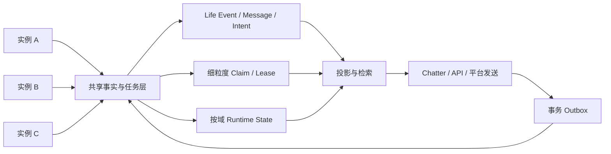

# Elysium 多实例共享 MySQL 重构方案

> 状态：设计稿，待用户评审；本文件只定义目标架构与迁移合同，不代表代码、数据库 schema 或生产运行已经切换。
>
> 目标：允许多个 Elysium 后端实例同时运行、同时连接同一个 MySQL、共同服务同一持续主体，并把当前 `runtime_context:global` 的跨实例陈旧快照冲突改造成细粒度、可合并、可恢复的业务并发协议。
>
> 设计边界：不接受把整个 Life Engine 退回单一全局 writer；不通过更换 MySQL 用户规避业务冲突；不以“最后写入覆盖”换取表面无报错；不改变主体文件、Life Event 历史和意识实例私有上下文的权威边界。

## 1. 决策摘要

Elysium 当前已经具备 MySQL shared generation、事务 authority fencing、多个领域 Port 和多种 revision/CAS 合同，但 `life_engine.runtime_context:global` 仍被多个运行实例作为一份长期缓存的完整 JSON 快照共同写入。实例在启动或上次成功保存时得到 `expected_revision`，冲突后没有重新读取、按字段合并和有限重试，因此一个实例可以长期停留在旧 revision 并持续失败。

本方案采用以下目标组合：

1. **Shared generation，多实例均可写**：保留 backend/generation/epoch/token 的事务 fencing；不把它解释为业务单实例所有权。
2. **移除 global runtime singleton claim**：`life_engine.runtime_context/global` 不再要求 generation-scoped singleton writer；第二实例不得因缺少该 claim 而启动失败。
3. **事实追加、投影分离**：Life Event、消息事实、动作意图和审计记录使用稳定 occurrence/id 幂等追加；当前上下文和检索结果是投影，不得反向替代历史。
4. **细粒度 operation claim**：消息、stream turn、heartbeat operation、outbox action、索引任务按业务键原子认领；claim 只保护一件具体工作，不封锁整个实例。
5. **runtime context 增量提交**：短期先保留 `runtime_states` 表，但禁止用旧进程的完整 payload 覆盖数据库最新 payload；保存改为事务内读取最新状态并应用可证明的 delta。
6. **按域拆分热点**：优先拆出 pending、chatter cursor、thought cursor、heartbeat checkpoint 和 projection progress，逐步降低单行热点。
7. **外部副作用 outbox 化**：飞书等平台发送先记录 action intent，再由一个 claim owner 执行并回写结果；不把“数据库未提交”误判为“外部未发送”。
8. **本地投影显式隔离**：MySQL 共享权威不等于 Chroma、workspace、媒体和缓存自动共享；每个投影必须有自己的 identity、进度和重建路径。
9. **新旧版本隔离迁移**：singleton trigger/claim 已经进入当前 main 和远端 schema，不能直接让旧实例与新协议混跑；必须先停写、备份、迁移、验证，再启用多实例协议。

预期结果：多个实例可以同时启动、同时接收和处理不同工作；同一消息、同一 stream turn 或同一外部动作不会被无协调地重复执行；不同实例更新不同业务域时不再因为整份 global 快照互相制造冲突；一个实例故障后，未完成工作可以由其他实例按租约接管。

## 2. 约束与非目标

### 2.1 必须保持的不变量

- Elysium 仍然是数字生命系统，不是无状态聊天服务。
- 意识、学习、记忆、技能和具身体验围绕同一持续主体组织；进程、机器、平台和模型不是新主体。
- 原始 Life Event、Experience、claim、证据、解释、主体文件版本和回忆轨迹只追加，不静默覆盖或删除。
- 同一稳定身份重复投递必须幂等；同一身份出现不同内容必须形成显式冲突。
- 消费游标只能在该批工作完整成功后推进；历史缺口不能跳过。
- 私聊、群聊、直播、游戏和具身场景的私有滚动上下文保持隔离；跨实例协调只能通过带来源的事实、Presence、World Projection 和明确的服务 Port。
- Chroma、FTS、摘要、当前上下文、缓存和健康统计是可重建投影；投影失败不能污染权威历史。
- 工程并发规则只保护资源、顺序、幂等、权限和数据安全，不替主体裁决意义、价值、真相或表达。
- 外部发送、进程控制和其他不可逆副作用必须有当前授权、稳定动作身份、状态和审计。

### 2.2 非目标

本方案不承诺：

- 多实例让同一个 `chat_global` 模型轮次无序并行；同一 stream 仍需保持顺序。
- 网络层或外部平台绝对 exactly-once；外部系统不提供幂等能力时，采用至少一次传输加可审计恢复。
- 每台机器自动拥有一致的本地 Chroma、workspace 或媒体文件；这些必须单独解决。
- 不修改代码即可安全双机运行；架构协议必须落到代码、schema、测试和运维合同。
- 不停服务、不停写、不做维护窗口就能把现有 singleton trigger/claim 无损改成新协议。
- 通过简单递归合并 JSON、取最大 revision 或最后写入者胜出解决语义冲突。

## 3. 当前问题基线

### 3.1 当前写入路径

当前运行态保存大致为：

```text
进程启动/上次成功保存
  -> load runtime_context/global
  -> 内存持有完整 LifeEngineState、pending_events、event_history
  -> heartbeat、消息收集或 Chatter 修改内存
  -> put_state(full_payload, expected_revision=进程内 revision)
  -> revision CAS
```

数据库 adapter 以 `SELECT ... FOR UPDATE` 读取当前行，并要求数据库 revision 精确等于调用方的 `expected_revision`。这个 CAS 本身可以防止旧 payload 直接覆盖新 payload，但调用层把冲突当成最终失败，没有完成：

```text
reload latest -> calculate delta -> merge -> retry
```

因此现场表现为：

```text
本机 expected=862
远端 actual=865 -> 873 -> 879 -> 881 -> 882 -> 886
```

之后 heartbeat、消息收集、Chatter 游标、结构化思考快照和关闭保存都反复使用旧 expected，形成级联错误。

### 3.2 当前 main 的 singleton writer 变化

当前 main 已包含：

```text
04faf67 fix(storage): fence singleton runtime writers
dcf0e1f feat(storage): expose singleton trigger binding
```

这些提交为 `life_engine.runtime_context/global` 增加 generation-scoped singleton writer claim、lease epoch、token、事务 binding 和数据库 trigger。有效 claim 已被其他 owner 持有时，第二实例会失败关闭；无 binding 或错 token 的写入会被拒绝。

该机制适合真正需要单实例 owner 的资源，例如某个具身控制面、同一 stream 的执行租约或不可重复的外部动作；不适合用户要求的“多个 Elysium 后端同时接入同一 MySQL、共同写入共享主体事实”的全局 runtime state。

退场必须通过迁移合同完成，不能直接删除本地代码或直接删远端 claim/trigger 表。

## 4. 目标运行架构



### 4.1 角色

- **实例节点**：拥有唯一、稳定、可审计的 `instance_id`；可以连接同一 generation，接收平台事件、写入事实、认领具体任务和提供 API。
- **共享事实层**：保存不可变事件、消息事实、动作意图、处理结果和冲突证据。
- **细粒度协调层**：按 `message_id`、`stream_id + turn_id`、`operation_id`、`action_id` 或 `job_id` 提供短期 claim/lease。
- **runtime state 层**：保存按域拆分的可变投影或增量状态；每次更新必须有明确 merge contract。
- **projection 层**：从权威事实重建当前上下文、FTS、Chroma、摘要和查询视图。
- **外部副作用层**：使用 outbox/action 状态和稳定 idempotency key，将数据库事务与平台发送分离。

### 4.2 实例标识

每个实例必须配置或生成：

```text
deployment_id       部署/节点稳定身份
instance_id          本次进程唯一身份
owner_id             authority 审计来源，不能代表全局独占权
boot_id              本次启动身份
config_digest        关键运行配置摘要
schema_generation    兼容的协议/数据库 generation
```

实例 ID 必须进入 claim、任务结果和 content-free 日志；不得把数据库密码、fencing token、消息正文或主体私密原文写入实例健康输出。

## 5. 数据权威与并发所有权

| 数据域 | 权威记录 | 多实例写法 | 冲突策略 | 是否允许全局 singleton |
| --- | --- | --- | --- | --- |
| Life Event | 不可变 event + payload hash | occurrence 唯一键追加 | 同 ID 异内容显式冲突 | 否 |
| 入站消息 | message identity + 原始内容 | 唯一键写入，处理另行 claim | 同消息幂等 | 否 |
| stream turn | turn/sequence + result | 按 stream 原子认领 | 同一 turn 仅一 owner | 否，按 stream claim |
| heartbeat operation | operation identity + checkpoint | 具体轮次原子认领 | 已完成视为幂等 | 否，按 operation claim |
| chatter cursor | stream/consumer cursor | 事务内 CAS 或 frontier 更新 | 不能倒退，不能越过缺口 | 否 |
| subject document | version/head/parent | 版本追加 + head CAS | 不同 parent 显式冲突 | 否 |
| Presence | instance/session/revision | 按实例/stream mutation | revision/owner/lease 合同 | 局部 stream 可有 owner |
| World projection | event frontier + projection | 按 frontier 原子推进 | 缺口停住，不跳过 | 否 |
| Memory index job | job identity + lease | 数据库原子认领 | 完成/失败/过期可重放 | 否 |
| 外部发送 | outbox action + platform receipt | action claim | sent/unknown/retryable 分开 | 否，按 action claim |
| Chroma/FTS | 可重建投影 | 每实例或共享服务 | 从权威历史重建 | 否 |
| `runtime_context/global` 过渡态 | 过渡兼容快照 | 最新读取 + delta 合并 | 按字段/事件语义合并 | 否 |

局部 owner 不等于全局唯一 writer：一个实例可以暂时认领某个 stream turn 或 outbox action，但其他实例仍可处理其他 stream、其他 action 和其他事实。

## 6. Runtime Context 重构

### 6.1 过渡阶段：保留表，改变写入语义

第一阶段不立即删除 `runtime_states` 的 `life_engine.runtime_context/global`，以降低迁移风险。保存接口从：

```python
put_state(full_payload, expected_revision=local_revision)
```

改成逻辑等价于：

```python
commit_runtime_delta(
    namespace="life_engine.runtime_context",
    state_key="global",
    base_revision=local_revision,
    delta=explicit_delta,
    operation_id=operation_id,
)
```

短事务内：

1. 通过 shared-generation authority fence 验证当前写入资格。
2. 锁定 `runtime_states` 当前行。
3. 读取数据库最新 payload 和 revision。
4. 校验 `operation_id` 是否已提交；已提交则返回幂等结果。
5. 根据 delta schema 合并本次变化；不能解释的冲突拒绝，不做最后写入覆盖。
6. 写入新 revision、delta receipt、operation identity 和更新时间。
7. 事务提交后更新本进程缓存；提交失败不推进内存已确认游标。

事务内禁止调用模型、Embedding、飞书、文件扫描、Chroma 或其他无界 I/O。

### 6.2 Delta 类型

Delta 不是认知裁决，而是已发生工程事实和主体已产生结果的持久化载体。至少支持：

```text
append_event              新增带稳定 identity 的 Life Event
append_pending_message    新增待处理消息 identity
claim_turn                 认领具体 stream turn
commit_turn                提交已完成 turn 的结果引用
advance_stream_cursor     按连续 frontier 推进某个 stream/consumer
append_heartbeat_result    追加一轮 heartbeat 结果与 checkpoint
set_technical_projection  更新可重建投影元数据
append_failure             追加持久化失败证据
```

禁止把 `delta` 设计成“任意字段覆盖 JSON”。每个 delta 必须声明：

```text
operation_id
causation_id
actor/source
stream_id 或 consciousness_instance_id（若适用）
base frontier（若需要）
payload hash
schema version
```

### 6.3 长期阶段：拆分热点

完成过渡稳定性后，逐步引入独立 runtime state：

```text
life_engine.pending:<stream_id>
life_engine.chatter_cursor:<stream_id>:<consumer_id>
life_engine.thought_cursor:<stream_id>:<consumer_id>
life_engine.heartbeat:<consciousness_instance_id>
life_engine.heartbeat_operation:<operation_id>
life_engine.projection:<projection_name>:<node_id>
life_engine.sync:<consumer_id>
```

`global` 只保留真正不可拆的技术元数据，不能继续承载所有 pending、history、cursor 和 heartbeat 字段。

### 6.4 合并原则

- append-only 集合按稳定 identity 去重；不同 payload hash 形成冲突。
- 有序事件按 `sequence/frontier` 推进；不能因为远端 revision 更大就跳过缺口。
- cursor 只能提交已经完整完成的连续前沿；不能简单取最大值。
- 计数器由 operation identity 或数据库原子增量更新，不能用旧快照覆盖。
- 时间字段按其语义处理，不能统一取最大或最后写入。
- heartbeat 的主体上下文由实际完成该 operation 的证据提交；失败不写成成功。
- 认知内容、主体文件和开放解释不得由并发合并器改写、分类、截断或替主体裁决。

## 7. 消息与 Stream 协议

### 7.1 入站事件

入站事件先以稳定平台 event identity/occurrence identity 写入共享事实表：

```text
message_id
platform_event_id
occurrence_id
payload_hash
chat_id
stream_id
received_at
source
status
```

唯一约束至少覆盖：

```text
(source, occurrence_id)
(platform, platform_event_id)
```

同一身份同一 hash 视为幂等；同一身份不同 hash 写入 `sync_conflicts` 或 message conflict，禁止静默选择一个。

### 7.2 处理认领

处理认领按消息或 stream turn 原子完成：

```text
pending -> claimed(owner, lease_until, claim_epoch)
claimed -> processing
processing -> completed / retryable / failed / unknown
```

claim 事务只做数据库状态变更。模型处理在事务外进行。实例崩溃后，其他实例等待数据库时间确认 lease 过期再接管。

### 7.3 同一 stream 顺序

同一 `stream_id` 保留顺序约束。多实例不是让同一聊天流的两个模型轮次同时推进，而是：

- 不同 stream 可以并行；
- 同一 stream 的 turn 由具体 owner 处理；
- 后续消息留在 pending，不被另一实例越序处理；
- turn 完成后以连续 frontier 推进 cursor；
- owner 失败时，租约过期后从持久化 checkpoint 恢复。

## 8. Heartbeat 协议

本方案不设置 `runtime_context/global` 全局唯一 writer。Heartbeat 作为可认领的具体 operation：

```text
heartbeat_operation_id
consciousness_instance_id
input_frontier
prepared_context_digest
status
claim_owner
claim_epoch
model_request_id
result_digest
committed_frontier
```

流程：

1. 任一实例从共享事件/heartbeat queue 读取下一个可处理 operation。
2. 在短事务内按 `operation_id` 原子 claim。
3. 事务外准备上下文并调用 `core` 模型。
4. 以 operation claim、输入 frontier 和结果 digest 提交 checkpoint。
5. 已完成 operation 的重试返回已有结果，不重复产生 heartbeat 事实。
6. 提交冲突时读取 operation 当前状态；不能把旧模型结果覆盖已完成结果。

如果某个主体/stream 的业务不变量要求严格单序列，限制的是该 `operation sequence`，不是整个 MySQL 或所有 Elysium 实例。其他实例仍可处理事实写入、不同 stream 和不同 operation。

## 9. Outbox 与外部副作用

所有平台发送、动作执行和不可逆外部操作统一使用 outbox：

```text
action_id
idempotency_key
source_event_id
target
payload_hash
status
claim_owner
claim_epoch
lease_until
provider_request_id
provider_receipt_id
error_type
attempts
```

规则：

- 数据库事务先落 action intent，再允许后台发送。
- 只有 claim owner 执行一条 action；其他实例不能重复执行同一 action。
- `sent`、`unknown`、`retryable`、`failed` 不可混为一个状态。
- 外部发送成功但回执未落库时进入 `unknown`，不得简单当成未发送。
- 平台支持幂等键时必须传稳定 key；不支持时保留 request/receipt 和不确定性审计。
- 发送结果不能通过全量 runtime payload 覆盖其他实例的消息或心跳状态。

## 10. Memory、索引与 Chroma

### 10.1 权威边界

- Life Event、Memory experience、document version、evidence 和 correction 是权威历史。
- memory index job 由 MySQL 原子 claim/lease 分发给多个实例。
- Chroma、FTS、chunk collection 和 artifact head 是可重建投影。
- MySQL job `completed` 不能直接代表每台机器的本地 Chroma 都已经完成。

### 10.2 本地 Chroma 选项

短期允许每实例维护自己的 Chroma，但必须记录：

```text
projection_node_id
collection_identity
source_revision/frontier
embedding_model
embedding_dimension
last_success_at
backlog
status
```

每台机器的本地 projection 独立 claim、独立重建；不能由某一台完成 MySQL job 后让另一台假定本地向量存在。

长期优先级：

1. 共享 Chroma/向量服务；或
2. 统一共享 workspace + 每实例独立、可重建的投影；或
3. 明确请求路由固定到拥有对应本地 projection 的节点。

任何方案都不能反向修改 Life Event 或主体文件。

## 11. Singleton Claim 与 Trigger 退场

当前生产/远端已存在 singleton claim 相关代码和可能的 trigger。退场必须分为四步，不能直接删除：

### 11.1 兼容准备

- 新代码增加 `runtime_state_writer_mode` 或 schema protocol version。
- 新版 adapter 能识别 `shared-delta` 模式。
- 旧 singleton claim/trigger 仍保留，但不立即改变正式 key。
- 新实例启动前只读核对 generation、migration version、claim/trigger 状态。

### 11.2 维护窗口迁移

1. 用户手工停止所有正在连接该数据库的 Elysium 实例；不得由 agent 自动重启。
2. 创建 `runtime_states`、claim、binding、trigger 和相关事件表的逻辑备份，并记录 SHA-256。
3. 导出正式 `runtime_context/global` 当前 payload、revision、payload hash 和最后更新时间。
4. 执行幂等 schema migration，创建 delta/operation/outbox 表和索引。
5. 将现有 global snapshot 包装为一个初始 checkpoint，不改主体正文、不重写事件语义。
6. 在新协议启用前禁用或移除针对 `runtime_context/global` 的 singleton trigger/binding 要求；保留局部资源需要的 claim 合同。
7. 只读校验旧快照与初始化 checkpoint 的 hash、字段和 frontier。
8. 用户手工启动一个新协议实例，完成读写冒烟后再启动第二个实例。

### 11.3 双实例影子验证

新协议实例先只写随机 namespace/隔离测试 stream，不接正式外部发送。验证：

- 两实例同时 claim 不同 operation 成功；
- 同一 occurrence 重放幂等；
- 同一 operation 只能一个 owner；
- runtime delta 两边都保留；
- 失效 claim 能被接管；
- 老 trigger 不再阻止 shared-delta；
- 旧 token/错 generation 仍然被 authority fence 拒绝。

### 11.4 正式切换与旧版本封锁

- 提高 schema/protocol generation，使旧 singleton writer 版本在启动检查时 fail closed。
- 旧版本不得继续连接正式 shared-delta generation。
- 完成双实例真实消息、模型、outbox 和关闭验收后，才允许增加到更多实例。
- 旧备份、旧 claim 审计和旧 global snapshot 保留，不直接删除。

## 12. 迁移阶段

### 阶段 0：协议冻结

交付：

- 数据域 ownership matrix；
- runtime context 字段/delta 目录；
- operation、claim、outbox schema 草案；
- singleton trigger 退场脚本设计；
- 双实例测试矩阵；
- 性能基线采集方案。

验收：用户确认“多个实例同时可写”是硬需求；确认哪些局部资源仍然必须独占；确认 workspace、媒体和 Chroma 部署边界。

### 阶段 1：shared-delta 基座

交付：

- `runtime_context/global` singleton claim 解耦；
- delta operation 表/Port；
- 短事务最新读取、合并、提交；
- 幂等 operation identity；
- 失败不推进本地 confirmed revision 的合同。

验收：两个 fake MySQL writer 同时更新不相交 delta，最终两者均保留；相同 operation 重放不重复；不可合并冲突显式失败。

### 阶段 2：消息与 stream

交付：

- 入站 occurrence 唯一键；
- message claim/lease；
- stream turn sequence；
- Chatter cursor 独立持久化；
- 同一 stream 顺序和跨 stream 并行。

验收：两实例同时收到同一消息时只有一份处理结果；不同 stream 可并行；owner 崩溃后可接管；未完成 turn 不推进 cursor。

### 阶段 3：heartbeat 与 runtime 热点拆分

交付：

- heartbeat operation claim；
- heartbeat checkpoint 与输入 frontier；
- pending、thought cursor 和 projection progress 独立化；
- 去除 global full-payload 依赖。

验收：两实例同时产生不同 heartbeat operation 不互相覆盖；同一 operation 重试幂等；未完成模型调用不会推进 committed frontier。

### 阶段 4：outbox 与本地投影

交付：

- 平台发送 outbox/action；
- Chroma 每实例 projection contract 或共享向量服务；
- workspace/媒体内容寻址或共享对象存储；
- 配置 digest 和 readiness 诊断。

验收：发送崩溃窗口可恢复；unknown 状态可诊断；投影损坏可从历史重建；实例之间检索能力边界明确。

### 阶段 5：扩大实例数

先双实例，再三实例，最后按需扩大。每扩大一档都重新验证 MySQL 锁等待、连接池、模型 provider 限流、outbox 吞吐、重复事件和 p95。

## 13. 性能与容量预算

### 13.1 单请求路径

模型调用、外部网络和文件/向量 I/O 不得位于数据库锁内。理想热路径：

```text
短事务写入/认领
-> 事务外模型或外部调用
-> 短事务提交 delta/result
-> outbox claim/send
```

预期变化不是“每条消息显著加速”：

- 单条私聊增加少量 claim、delta 和 receipt SQL，通常被秒级模型耗时掩盖；
- 同一 stream 仍串行，尾部消息可能排队；
- 不同 stream 和不同 operation 可以并行，整体吞吐和高负载 p95 应改善；
- 单实例最低延迟可能优于多实例，但多实例故障恢复和总体可用性显著提升。

未经双实例实测，不写固定毫秒承诺。必须采集：

```text
single-instance p50/p95/p99
2-instance p50/p95/p99
same-stream queue delay
cross-stream throughput
DB lock wait / deadlock / retry
claim takeover delay
model calls per occurrence
duplicate send count
outbox unknown duration
```

### 13.2 预算边界

初始验收目标由现场基线决定，建议至少记录并比较：

- 单条普通私聊新增数据库协调延迟不超过现有端到端 P95 的 10%；
- 同一 stream 的额外排队必须能在日志中区分“正常顺序等待”和“异常锁等待”；
- 任一短事务不包含模型/外部网络，锁持有时间按数据库实测设上限；
- lock wait、deadlock、claim retry 和 unknown outbox 必须可观测，不以无限重试隐藏；
- 双实例不同 stream 的总体吞吐不能低于单实例基线，除非 MySQL 或模型 Provider 已成为明确瓶颈。

这些是验收门，不是认知或表达的硬阈值；达到或未达到都必须保留真实测量证据。

## 14. 失败、回滚与数据安全

### 14.1 失败语义

- 事实写入失败：保留待同步/待重试状态，不返回成功。
- claim 失败：返回已认领、已完成或可稍后重试，不伪造空结果。
- delta 不可合并：写入冲突证据，停止该 operation 的 cursor 推进。
- 模型成功但提交失败：保留 operation 和模型 request/result digest，按 operation 状态恢复，不盲目再次调用。
- 外部发送结果未知：标记 `unknown`，不直接重复发送或静默丢弃。
- projection 失败：标记 `degraded/failed`，保留权威历史并提供重建入口。
- 关闭失败：释放本实例已拥有资源，但不能释放或覆盖其他实例的 claim。

### 14.2 回滚策略

如果阶段 1/2 发现严重问题：

1. 停止新协议实例的写入来源；
2. 保留 delta、operation、claim 和 outbox 表，不删除；
3. 从备份和已确认 checkpoint 生成只读诊断；
4. 只有在证明旧版本仍能读取且没有新协议写入混入时，才允许回到兼容桥；
5. 已经追加的事实不得通过回滚删除；需要由投影重放恢复旧视图；
6. 旧版本和新版本不能同时写同一 generation，必须通过 schema/protocol version 隔离。

### 14.3 备份

维护窗口前必须备份：

- `runtime_states`；
- `runtime_events`；
- singleton claim/binding/trigger 相关表；
- 新增 operation/claim/outbox 表；
- 生命事件、记忆和 Core 关系数据的现有正式备份。

备份保存路径、权限、大小和 hash 只写本机运维记录，不写公共文档中的真实密钥或个人部署值。

## 15. 测试矩阵

### 15.1 存储合同

- shared-generation 下两个不同 owner 同时写入成功；
- generation/epoch/token 错误仍 fail closed；
- `runtime_context/global` 不再要求 singleton claim；
- 局部 singleton 资源仍拒绝第二 owner；
- delta operation 幂等；
- 不相交 delta 合并；
- 同一字段不可合并冲突显式保留；
- deadlock、1205、连接取消和 session rollback 有界恢复；
- trigger 退场后旧旁路写入仍按 schema/权限禁止，不绕过 authority。

### 15.2 消息与主体

- 双实例重复入站同一 occurrence；
- 同一 occurrence 异 hash；
- 不同 stream 并行；
- 同一 stream 顺序；
- owner 在模型调用前、调用中、提交前崩溃；
- heartbeat operation 重试和接管；
- pending/event cursor 不越过缺口；
- Life Event 原文、来源、actor、causation 和时间保持不变。

### 15.3 外部动作

- outbox claim 竞争；
- 发送成功后回执前崩溃；
- 发送失败和超时；
- unknown 状态恢复；
- 同 action 不重复产生业务发送；
- 飞书真实私聊回执、chat_id 和引用消息 ID 合同保持。

### 15.4 投影与重启

- 两实例各自 Chroma 投影进度不互相伪造完成；
- 投影损坏从 Life Event/Memory history 重建；
- workspace 内容差异显式报告；
- 启动、重复启动、关闭、取消和重连幂等；
- 完整恢复后上下文、cursor、memory、outbox 和审计可追溯。

## 16. 生产验收门

在以下条件全部满足前，不能宣称支持多实例生产运行：

1. singleton trigger/claim 对 `runtime_context/global` 已完成受控退场并有备份/hash。
2. 两个新协议实例使用不同 `instance_id` 同时启动，均加入同一 verified generation。
3. 两实例同时写不相交 runtime delta，数据库最终保留双方结果。
4. 两实例同时投递同一消息，只有一个处理结果和一个可审计发送 action。
5. 不同 stream 并行时无全局 context revision cascade。
6. 同一 stream 保持顺序，失败接管不跳过未完成事件。
7. heartbeat operation 不重复提交；模型失败不推进消费 frontier。
8. MySQL lock wait、deadlock、claim takeover 和 retry 均有上限和健康输出。
9. Chroma、workspace、媒体的共享/独立边界已经明确并通过真实验收。
10. 关闭一个实例后，另一个实例仍能接收新消息并在租约过期后接管未完成工作。
11. 新旧版本不能混连正式 generation；回滚演练通过。
12. 单实例基线与双实例 p50/p95/p99、吞吐、模型调用数、重复发送数有真实记录。

## 17. 最终取舍

当前单终端正常运行的优势是路径短、延迟最低、状态边界简单；多实例重构的主要收益是高可用、跨实例并发和故障接管，不是让同一条模型回复显著加速。

重构后可接受的代价：

- 每条消息增加少量数据库协调；
- 同一 stream 仍然排队；
- claim 到期接管存在短暂等待；
- MySQL 和观测系统的重要性提高；
- 本地投影需要额外一致性设计；
- 部署、测试和排障复杂度上升。

不可接受的代价：

- 第二实例因全局 singleton claim 启动失败；
- 用旧 full snapshot 静默覆盖新状态；
- 事实丢失、cursor 越过缺口或主体语义被自动合并改写；
- 同一外部动作无审计地重复发送；
- 失败被伪装成成功或空结果。

最终架构结论：

> **Elysium 采用 shared-generation + 多实例事实写入 + 细粒度 operation claim + runtime context 增量合并 + append-only event/outbox + 可重建投影。**
>
> **不使用 `runtime_context/global` 全局 singleton writer 作为多实例前提；真正需要独占的资源只在具体业务键上使用局部 claim。**
