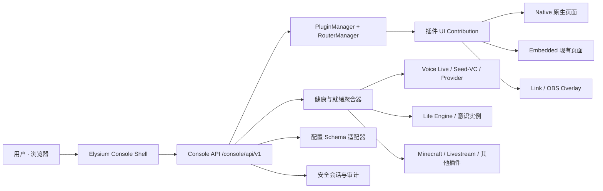

# Elysium Console：项目级可演进前端提案

> 状态：用户已于 2026-08-02 批准；Stage 0 交互原型与契约基线已完成
>
> 日期：2026-08-02
>
> 目标：为 Elysium 建立统一、美观、可随插件增删而演进的项目级前端，并把 Voice Live 作为第一条旗舰体验跑通。

## 1. 结论

Elysium 需要的不是一个写死功能列表的“后台管理页”，而是一个稳定的数字生命控制台：

- 控制台外壳保持稳定；
- 当前实际加载的插件向控制台声明自己能提供的页面、状态、操作和 OBS overlay；
- 导航、首页入口、健康状态和设置表单根据运行时能力自动生成；
- 插件被停用、替换或删除后，入口自动消失，旧书签进入明确的“功能当前不可用”页面；
- Voice Live、Minecraft、直播等体验各自保留独立意识和专业交互，不被压扁成通用 CRUD 页面；
- Elysium 主进程仍只能由用户手工启动，控制台不接管、不重启、不自动拉起主进程。

建议采用“稳定 SPA 外壳 + 能力注册表 + 三种插件页面接入方式”的混合架构，而不是完整 Module Federation：

1. `native`：旗舰体验使用控制台内的类型安全原生页面；
2. `embedded`：现有同源页面先通过受控嵌入接入，降低迁移风险；
3. `link/overlay`：独立工具页和 OBS 透明页面保留独立 URL。

这套结构既能让第一版尽快可用，也不会因为后续功能频繁变化而把前端重新推倒。

## 2. 现状审计

当前项目已经拥有多套前端，但它们彼此孤立：

| 页面 | 当前入口 | 观察 | 处理建议 |
|---|---|---|---|
| Voice Live | `/voice-live/` | 已有完整深色视觉、通话状态和指标，但缺少启动前检查与统一入口 | 第一批迁移为原生旗舰页 |
| Voice Live OBS | `/voice-live/overlay` | 已是透明只读输出 | 保持独立 URL，控制台负责预览与复制 |
| Livestream | `/livestream/` | 功能存在，但页面接近浏览器默认控件 | 第一批视觉重做 |
| 记忆健康 | `/api/v1/admin/memory` | 正式、只读、content-free 运维入口 | Console 原生健康与连续性索引诊断；不恢复旧 graph dashboard |
| Life 时间线 | `/message_timeline/` | 可观测性丰富、视觉较完整，但没有权限分层和统一导航 | 先嵌入，后拆成控制台原生模块 |
| LLM Inspector | 内核挂载页 | 有调试价值，但不适合普通模式首页 | 归入“诊断”并限制权限 |

现有核心能力已经为统一前端打下了基础：

- `RouterManager` 能列出已注册、已挂载的 Router 及路径；
- `PluginManager` 能列出已加载、未加载和失败插件；
- 插件已有 `manifest.json`、依赖、版本和组件声明；
- 配置系统的 `Field` 已支持 `label`、`tag`、`placeholder`、`hint`、`order`、`hidden`、`disabled`、`input_type`、条件显示等 WebUI Schema 元数据；
- Voice Live 已经具备短期单次 ticket、同源校验、健康接口、WebSocket 和 OBS observer；
- HTTP 当前仅监听 `127.0.0.1`，适合先做本机控制台。

因此，主要缺口不是“再做几个 HTML”，而是统一能力协议、统一安全会话、统一外壳和统一设计系统。

## 3. 设计原则

### 3.1 插件驱动，不按插件名硬编码

控制台不能写成：

```text
如果 voice_live 存在就显示 Live
如果 minecraft 存在就显示 Minecraft
```

插件应通过声明提供能力；控制台只理解稳定的能力类型，例如 `experience`、`dashboard`、`settings`、`overlay` 和 `diagnostic`。新插件只要声明兼容能力，就能自动获得入口。

### 3.2 能力消失是正常状态

功能增删、插件加载失败、依赖未就绪都不能让整个控制台白屏。每个页面需要独立错误边界，首页只展示当前运行时确认存在的能力；旧路由显示原因、最后已知版本和返回入口。

### 3.3 “她的家”，不是通用 SaaS 后台

视觉应具有爱莉和 Elysium 的身份，但不能为了粉色、玻璃和粒子牺牲信息层级。核心感觉是夜色、呼吸、柔和高光和生命状态，而不是模板化后台或过度二次元装饰。

### 3.4 观察、建议与控制分层

控制台可以展示她正在使用哪个意识实例、当前模式和外部链路状态；不能把爱莉的意志简化成一组强制开关，也不能在代码层自动替她触发技能。用户启动模式和外部设备属于基础设施控制，爱莉在模式内如何表达仍由意识实例决定。

### 3.5 失败必须显式

Realtime Key 缺失、Seed-VC token 不匹配、Provider 不可达、麦克风权限被拒绝时，应在启动按钮旁给出准确原因和修复入口。不得静默切换模型、静默回退原声或假装通话已开始。

## 4. 总体架构



### 4.1 Console 自身也是插件

新增 `elysium_console` 插件，挂载在 `/console/`：

- 提供静态 SPA；
- 提供能力注册、健康聚合、设置 Schema 和会话接口；
- 读取现有管理器，不复制插件加载逻辑；
- 不成为 Life Engine 的第二个中枢；
- 不控制 Elysium 主进程生命周期。

### 4.2 能力注册表

插件 `manifest.json` 增加可选且版本化的 `ui` 字段。示意：

```json
{
  "ui": {
    "schema_version": 1,
    "contributions": [
      {
        "id": "voice-live",
        "kind": "experience",
        "title": "实时通话",
        "description": "和爱莉自然地通话",
        "icon": "microphone",
        "group": "together",
        "order": 10,
        "display": "native",
        "route": "/console/live",
        "source_route": "/voice-live/",
        "health_endpoint": "/voice-live/health",
        "permissions": ["owner"],
        "browser_capabilities": ["microphone", "audio-output"]
      },
      {
        "id": "voice-live-overlay",
        "kind": "overlay",
        "title": "通话直播层",
        "route": "/voice-live/overlay",
        "display": "link"
      }
    ]
  }
}
```

约束：

- `schema_version` 不兼容时拒绝加载该贡献，但不影响插件后端运行；
- contribution ID 在插件内唯一，运行时形成全局签名；
- 控制台只返回“当前已加载且 Router 已挂载”的能力；
- 前端不加载任意远程 JavaScript；
- 未声明 UI 的插件仍可正常运行，只是不出现在控制台功能入口。

### 4.3 为什么暂不采用完整 Module Federation

Module Federation 更适合多团队、独立部署的大型微前端。Elysium 当前是同仓库、本机运行、单产品身份；立刻引入远程运行时、共享依赖和跨构建版本协商，会增加比业务本身更大的调试面。

本提案保留升级路径：若未来确实出现多个独立团队和独立发布的前端插件，再让 `display` 增加受签名和 CSP 约束的 `federated` 类型。第一版不承担这项复杂度。

## 5. 信息架构

导航分成稳定区域与动态能力两层。

### 5.1 稳定区域

- **此刻**：爱莉当前状态、Elysium 健康、最近活动、快捷进入；
- **一起做**：由插件贡献的体验模式；
- **她的世界**：意识实例、记忆、日记、学习和时间线；
- **直播间**：开播准备、OBS overlay、音频链路和场景状态；
- **系统**：插件、模型、配置、诊断、版本和审计。

### 5.2 动态能力

当前可能出现：

- 实时通话；
- Minecraft；
- Livestream；
- 狼人杀；
- 画室；
- 记忆图；
- Life 时间线；
- LLM Inspector。

这些名称不写死在 Shell；插件启停后，导航由能力注册表重新生成。

### 5.3 首页结构

首页不做指标墙，而是回答三个问题：

1. 她现在是什么状态；
2. 哪些体验此刻可以进入；
3. 哪条链路需要我处理。

首屏建议包含：

- 中央 Presence：醒着、休息、通话、游戏、直播等运行状态；
- 主要行动：进入 Live、陪她玩、准备直播；
- 就绪卡片：绿色“可以开始”、琥珀“缺少一步”、红色“不可用”；
- 最近一件值得知道的事，而不是持续滚动的全部日志；
- 右上角全局状态点，点击后展开详细诊断。

## 6. 视觉方向

### 6.1 关键词

`Elysium at night`、`gentle presence`、`breathing light`、`pink crystal`、`quietly alive`。

### 6.2 设计系统

- 背景：接近黑蓝的夜色，不使用纯黑；
- 主色：克制的爱莉粉，主要用于行动和生命状态；
- 辅色：冰蓝用于系统信息，薄荷绿用于健康，琥珀用于待处理；
- 表面：低对比层级与少量半透明，不对每张卡都使用强玻璃效果；
- 动效：呼吸光、轻微视差和状态过渡；必须支持 `prefers-reduced-motion`；
- 字体：中文优先可读性，数值使用等宽数字；
- 图标：统一线性图标，不混用 emoji、字符图标和多套图标库；
- 状态不只靠颜色，必须同时有文字与图形；
- OBS overlay 使用独立透明设计令牌，不继承控制台背景。

### 6.3 品牌统一

所有用户可见与内部运行标识统一为 `Elysium` / `爱莉`，不再保留历史品牌别名。

## 7. Voice Live 旗舰路径

控制台中的 Live 不是“直接点开旧页面”，而是一条完整的准备—通话—收尾路径。

### 7.1 启动前检查

进入 Live 页面先并行检查：

- Voice Live Router 已挂载；
- Life Engine 已注册；
- Provider、模型和上游地址已配置；
- `VOICE_LIVE_API_KEY` 只报告“存在/缺失”，绝不返回值；
- 启用变声时，Seed-VC 服务、profile、采样率和 bearer token 验证通过；
- 当前通话容量可用；
- 浏览器支持 AudioWorklet/WebSocket；
- 麦克风设备与输出设备可选。

若有缺项，按钮旁直接显示修复步骤。需要进程环境变量或不可热重载配置时，明确提示“保存后需要你手工重启 Elysium”，控制台自身不执行重启。

### 7.2 通话界面

- 爱莉 Presence 和说话/聆听状态是主视觉；
- 开始、静音、主动抢话、结束是一级操作；
- Provider、音色、RTT、SVC 延迟等放入可展开诊断层；
- 最终转写保留，临时模型事件不淹没主界面；
- 打断、重连和错误状态使用清晰的时序提示；
- 页面刷新前警告当前通话会断开；
- 浏览器只能在用户点击后申请麦克风权限，不能假装“进入页面即自动开始”。

### 7.3 OBS

- 控制台提供 overlay 实时预览；
- 一键复制 Browser Source URL 和推荐分辨率；
- 显示 observer 是否连接、最近帧和音频状态；
- OBS 只读，不允许从直播层反向控制通话；
- Minecraft 画面继续由 Game Capture 捕获，通话字幕/音频由 Browser Source 提供。

## 8. 设置与插件频繁变化

### 8.1 Schema 驱动设置

直接复用项目已有 `Field` WebUI 元数据，生成 JSON Schema 风格的只读/编辑模型：

- 新增普通配置字段后，表单自动出现；
- `hidden` 字段永不下发；
- `input_type=password` 字段只显示是否配置，不回传原值；
- `depends_on` 决定条件显示；
- 保存前展示 TOML diff、验证结果和是否需要重启；
- 保存时原子写入并创建可恢复备份；
- 第一阶段仅做只读与就绪检查，配置写入在安全机制完成后再开放。

### 8.2 插件生命周期

- 加载成功：能力进入注册表；
- 加载失败：系统页显示失败原因，功能入口不出现；
- 插件停用：入口消失，数据不删除；
- 插件升级：检查 UI schema 版本和后端 API 合约；
- 插件删除：旧书签进入可解释的 404，不影响 Shell；
- 热重载：注册表可刷新，但不假设所有插件都支持无重启更新。

## 9. 技术方案

### 9.1 前端

- React 19 + TypeScript；
- Vite 构建，生产静态资源由 FastAPI 同源提供；
- 路由级懒加载与独立错误边界；
- TanStack Query 管理 HTTP 状态，功能专用 WebSocket 保留在各 feature adapter；
- CSS Custom Properties 作为设计令牌源，Tailwind 只作为消费层而不是设计真相；
- Radix 类无样式可访问原语作为复杂控件基础，业务视觉全部定制；
- Vitest + Testing Library + Playwright；
- 生产构建产物可提交或随发布构建，仓库固定 Node 与包管理器版本并提交 lockfile。

Vite 官方支持通过构建 manifest 与传统后端集成；React 官方 `lazy`/`Suspense` 支持按页面延迟加载。配置协议以 JSON Schema 2020-12 的稳定概念为参考，但保留 Elysium 现有 UI 扩展字段。

### 9.2 后端

建议新增以下接口：

```text
GET  /console/api/v1/bootstrap
GET  /console/api/v1/capabilities
GET  /console/api/v1/readiness
GET  /console/api/v1/plugins
GET  /console/api/v1/config/schema
GET  /console/api/v1/config/status
GET  /console/api/v1/events              # SSE，低频全局状态
POST /console/api/v1/session
POST /console/api/v1/actions/{action_id} # 白名单、类型化、可审计
```

Voice Live 继续使用自己的实时 WebSocket，不经全局 SSE 转发音频。

### 9.3 安全

- 只绑定 loopback 是默认前提；外网暴露必须显式配置反向代理与 TLS；
- 浏览器使用短期、HttpOnly、SameSite=Strict 的签名会话，不把 Core API Key 放入 localStorage；
- 写操作使用 CSRF 防护、权限校验和审计；
- 敏感配置只返回 `configured: true/false`；
- 控制台页面、插件嵌入页和 OBS overlay 使用不同权限；
- iframe 迁移页按能力设置 sandbox/allow，Live 的麦克风页优先原生迁移；
- 配置变更、模式启动和停止有结构化审计事件；
- 所有 HTML/Markdown/插件描述按不可信文本转义，禁止直接注入 HTML。

## 10. 分阶段实施计划

### 阶段 0：合同与视觉原型

交付：

- UI contribution v1 Schema；
- Console API OpenAPI 合同；
- 信息架构与设计令牌；
- 首页、Live 准备页、Live 通话页、插件不可用页的高保真原型；
- 迁移矩阵与安全威胁模型。

验收：原型覆盖 1440p、1080p 和窄屏；用户批准视觉和信息架构后才进入代码实现。

### 阶段 1：稳定 Shell 与只读控制台

交付：

- `elysium_console` 插件；
- `/console/` SPA；
- 动态导航、能力注册、首页、全局就绪状态；
- 插件状态、只读配置 Schema、错误边界；
- 现有页面的受控嵌入/跳转。

验收：随机启停一个测试插件，导航无需改前端代码即可出现/消失；任一插件 API 失败不导致 Shell 白屏。

### 阶段 2：Voice Live 原生旗舰页

交付：

- 完整 preflight；
- 设备选择、麦克风测试、通话、打断、结束和错误恢复；
- Qwen Realtime 与 Seed-VC 状态；
- OBS overlay 预览与复制；
- 当前旧 Voice Live URL 保留兼容跳转。

验收：必须在真实浏览器、真实麦克风、真实 Qwen Realtime、真实 Seed-VC 上完成一次可听通话；验证打断后旧音频零泄漏，OBS Browser Source 能听到变声结果。

### 阶段 3：直播、Minecraft 与生命面板迁移

交付：

- Livestream 视觉重做和开播准备页；
- Minecraft 模式入口、身体/Agent 路径状态与 OBS Game Capture 指南；
- Memory 与 Timeline 统一品牌、导航和令牌；
- LLM Inspector 归入诊断区；
- 旧直达 URL 保持兼容。

验收：每个模式至少一条真实端到端用例；插件删除或故障时控制台退化正确。

### 阶段 4：安全配置编辑器与插件开发体验

交付：

- 配置 diff、验证、原子保存与备份；
- restart-required 提示，不自动重启；
- 插件 UI manifest 校验器；
- 示例插件与开发规范；
- 视觉回归、可访问性与性能门槛进入 CI。

验收：配置 round-trip 不丢注释/未知字段；敏感字段不出现在 API、DOM、日志或测试快照。

## 11. 全链路验证标准

实现不能以“单元测试通过”作为交付终点，至少包括：

### 11.1 自动化

- Python 单元、集成和 Router 合同测试；
- TypeScript 类型检查、lint、单元和组件测试；
- OpenAPI/JSON Schema 契约测试；
- Playwright 桌面与窄屏 E2E；
- axe 可访问性检查；
- 视觉快照覆盖主要状态，而不仅是待机页；
- 插件新增、停用、失败、删除、版本不兼容矩阵；
- 安全测试：越权、CSRF、XSS、ticket 重放、敏感值泄漏。

### 11.2 实机

- 用户手工启动现有 Elysium 后访问 `/console/`；
- Live 真实麦克风与扬声器回环；
- Qwen Realtime 真连接；
- Seed-VC 真转换和打断；
- OBS Browser Source 与 Game Capture；
- Minecraft 真窗口/真服务器路径；
- 连续运行与断网、Provider 失败、插件崩溃恢复；
- 浏览器刷新、前后台切换、设备拔插和睡眠唤醒。

### 11.3 性能门槛

- Shell 首屏不加载 Memory 图、Live 音频和诊断代码；
- 路由级代码分割；
- 1440p 常规页面交互无明显卡顿；
- 全局 SSE 不承载高频音频/游戏帧；
- Memory 可视化与时间线使用虚拟化或采样，避免长时间运行后 DOM 无界增长。

## 12. 风险与处理

| 风险 | 处理 |
|---|---|
| 前端 Shell 反而变成新单体 | 能力协议稳定，业务页面按 feature 隔离，独立错误边界 |
| 插件任意前端代码污染主页面 | v1 不加载远程 JS；旧页 iframe 隔离；原生模块随主构建审计 |
| 配置编辑器泄露 Key | 第一阶段只读；敏感字段只返回 presence；写入后端完成 |
| Elysium 未运行时打不开控制台 | 明确边界：用户先手工启动 Elysium；不偷偷增加守护进程 |
| 旧页面迁移拖慢交付 | 先嵌入/跳转，旗舰路径原生化，逐页替换 |
| 视觉漂亮但不可维护 | 设计令牌、组件状态矩阵、视觉回归和可访问性门槛 |
| 高频插件变化破坏菜单 | 菜单来自当前运行时能力，不来自前端硬编码 |

## 13. 本轮不做的事情

- 不修改任何功能代码；
- 不停止、重启或自动拉起 Elysium；
- 不让前端管理 Elysium 主进程；
- 不把 API Key、Seed-VC token 或 Core API Key写入前端；
- 不立刻引入 Module Federation；
- 不在用户批准视觉原型前批量重写现有页面。

## 14. 请求批准的决策

建议批准以下默认方案：

1. 产品定位：`Elysium Console`，不是通用后台；
2. 地址：`http://127.0.0.1:18000/console/`；
3. 架构：稳定 Shell + 运行时能力注册 + native/embedded/link 三种贡献；
4. 技术栈：React + TypeScript + Vite，同源由 FastAPI 提供；
5. 第一旗舰路径：Voice Live；
6. 主进程边界：永远由用户手工启动，控制台只报告状态；
7. 先做高保真原型和合同，再进入功能实现。

批准后从阶段 0 开始；阶段 0 的视觉原型再次获得确认后，再进入阶段 1 和阶段 2 的实现与真实全链路验收。

## 15. 参考

- Vite Backend Integration：<https://vite.dev/guide/backend-integration>
- React `lazy`：<https://react.dev/reference/react/lazy>
- JSON Schema Draft 2020-12：<https://json-schema.org/draft/2020-12>
- Module Federation Introduction：<https://module-federation.io/guide/start/index.html>
