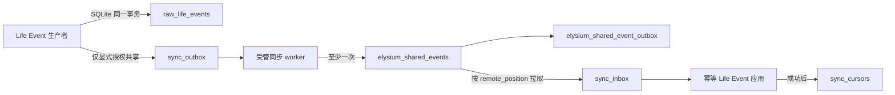

# Elysium 离线同步内核

> 状态：阶段二已实现并通过本地与远端 MySQL 8 全链路验证。运行中实例未重启；正式启用须在合并代码、配置环境变量后由用户手动重启。

## 1. 目标与边界

离线同步内核只负责跨节点传输保证，不替爱莉判断事件意义，也不把远端数据库变成本地生存的前提。它提供：

- 本地事件与 Outbox 的同事务提交；
- 至少一次投递和远端幂等应用；
- Inbox 先落盘、应用成功后再推进游标；
- 指数退避、崩溃租约恢复和严格顺序阻断；
- 同一身份不同内容的显式冲突记录；
- backlog、最后尝试/成功时间、远端可用性和降级原因。

阶段二不包含前端 API、SSE/WebSocket、用户权限和记忆共享策略界面；这些属于阶段三及以后。

## 2. 数据流



本地 `raw_life_events` 仍是 Life Event 权威记录。未请求共享的事件只写入该权威账本，不复制完整 payload 到 Outbox。

## 3. 共享授权

事件生产者必须同时提供：

```python
metadata={
    "visibility": "shared",
    "sync_export": True,
}
```

规则如下：

| 请求 | visibility | 结果 |
|---|---|---|
| 未设置 `sync_export=True` | 任意 | `local_only`，不创建 Outbox |
| 已请求 | `private` 或未知值 | `held`，不分配节点序号、不发送 |
| 已请求 | worker 白名单中的 `shared`/`public` | `pending`，分配连续节点序号 |

同步层不依据 `event_type`、关键词、分数或内容判断是否值得共享。远端导入时会强制移除导出请求并标记来源节点，防止回声重发。

## 4. 稳定事件身份

跨节点信封包含：

- `event_id`：全局事件身份；Life Event 桥接使用 `occurrence_id`；
- `origin_node_id + origin_sequence`：持久节点身份与单调本地序号；
- `payload_hash`：规范 JSON 的 SHA-256；
- `occurred_at` 与 `recorded_at`：发生时间和源端落盘时间；
- `event_type`、`actor_id`、`consciousness_instance_id`、`visibility`；
- `causation_id`、`correlation_id` 与 `schema_version`。

远端判定：

- 事件 ID、来源序号和哈希均相同：`duplicate`，视为成功；
- 事件 ID或来源序号相同，但不可变内容不同：`conflict`；
- 均不存在：事件与服务端 Outbox 在同一 MySQL 事务提交。

## 5. 本地 SQLite 表

同步表与 `raw_life_events` 位于同一个 `life_events.sqlite3`，从而避免跨数据库伪事务。

| 表 | 用途 |
|---|---|
| `sync_node_identity` | 持久节点 ID 与下一个来源序号 |
| `sync_outbox` | `held/pending/inflight/retry/confirmed/conflict` 投递历史 |
| `sync_inbox` | 远端事件的 `staged/applied` 记录 |
| `sync_cursors` | 每个消费者的远端确认位置 |
| `sync_conflicts` | 推送/拉取冲突证据 |
| `sync_runtime_state` | 最近尝试、成功、错误和远端可用性 |

Outbox 与 Inbox 的身份和 payload 列由 SQLite trigger 禁止修改，记录禁止删除。Outbox 只允许状态、租约、重试和远端确认字段变化；`held` 事件仅能在显式授权后分配一次来源序号。

## 6. 远端 MySQL 表

阶段二只新增以下命名空间，不改写原有 Core 或记忆表：

| 表 | 用途 |
|---|---|
| `elysium_sync_schema_meta` | 同步 schema 版本，当前为 2 |
| `elysium_sync_nodes` | 来源节点与最大已见序号 |
| `elysium_shared_events` | 远端追加式共享事件账本 |
| `elysium_shared_event_outbox` | 供阶段三 API/SSE 分发的事务 Outbox |
| `elysium_sync_conflicts` | 不可变身份冲突记录 |
| `elysium_consumer_cursors` | 服务端消费者游标预留 |

远端连接使用独立小连接池，不替换 Elysium Core 数据库引擎。密码只从 `remote_password_env` 指定的环境变量读取，健康输出不包含连接凭据或事件 payload。

## 7. 失败语义

| 故障 | 行为 |
|---|---|
| 启动时远端不可达 | Life Engine 继续启动；同步状态为 degraded，本地数据不丢失 |
| 推送中断 | Outbox 保留并指数退避，不越过失败序号 |
| 远端提交后本地确认前崩溃 | 租约到期后重放；远端返回 duplicate，本地转 confirmed |
| 同 ID 异内容 | 两端记录冲突；相关顺序停止，不伪装成功 |
| Inbox 应用失败 | 保持 staged，游标不前移，重启后重试 |
| 同一事件并发投递 | 唯一键与事务串行化；竞争失败后重新读取并返回 duplicate/conflict |
| worker 取消 | 由 Life Engine 的统一任务管理器等待退出并关闭连接池 |

投递保证是“至少一次 + 幂等应用”，不是依赖网络的“恰好一次”。应用回调本身必须可幂等重放。

## 8. 代码入口

- 通用契约与协调器：`src/kernel/sync/`
- Life Event 同事务桥：`plugins/life_engine/service/event_bus.py`
- Life Engine 适配器：`plugins/life_engine/service/shared_sync.py`
- 配置与生命周期：`plugins/life_engine/core/config.py`、`plugins/life_engine/service/core.py`
- 故障契约测试：`test/kernel/sync/test_offline_sync.py`
- MySQL 8 全链路测试：`test/kernel/sync/test_mysql_ledger_integration.py`

运维与启用步骤见 [离线同步运行手册](../operations/offline_sync_runbook.md)。
