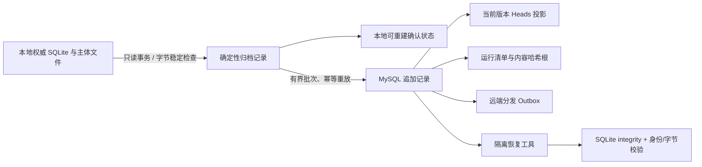

# Elysium 统一记忆归档架构

> 状态：已实现。本设计统一的是可验证的逻辑归档、跨机备份与恢复入口，不把所有记忆强行改造成一张表，也不把远端网络变成本地运行前提。

## 1. 决策

Elysium 的“记忆”并不是单一数据库：聊天与应用记录、原始生命事件、经验/见证/解释、意识在场、世界投影，以及 `SOUL.md`、`MEMORY.md`、日记和笔记具有不同权威语义。把它们一次性搬进同一个 MySQL schema 会破坏离线能力、SQLite 事务边界和主体文件语义。

因此采用两层结构：

1. 本地权威层继续按原职责写入 SQLite 和主体文件；断网时完整可运行、可检索、可形成新记忆。
2. 统一归档层只读扫描所有权威源，把每一行、schema 对象和文件字节规范化为可校验记录，追加到远端 MySQL，并维护可重建的当前版本投影。

“统一”意味着同一个节点身份、记录身份、运行清单、冲突协议、健康状态和恢复工具覆盖全部记忆域；不意味着抹平各域的语义边界。

## 2. 权威域

| 归档域 | 本地来源 | 权威性质 |
|---|---|---|
| `core` | `data/Elysium.db` | 聊天与应用权威快照 |
| `life_events` | `life_events.sqlite3` | 原始生命事件与导入证据 |
| `life_memory` | `.memory/memory.db` | 经验、见证、解释、claim、召回历史与投影 |
| `consciousness_presence` | `runtime/consciousness_presence.sqlite3` | 意识在场技术记录 |
| `world_projection` | `runtime/world_projection.sqlite3` | 可重建世界状态投影 |
| `workspace` | `life_engine_workspace/`、`data/diaries/` | 主体文件的逐字节版本 |

FTS、向量集合和同步运行状态等可重建投影不作为唯一灾备依据。SQLite schema 会归档，恢复时先重建 schema，再恢复行；主体文件按 SHA-256 和分块哈希恢复。

## 3. 数据流

扫描 SQLite 时使用同一只读事务，且同一个游标始终固定在专用线程中。扫描文件时比较读取前后的大小与纳秒修改时间；发生变化就拒绝本轮，不归档撕裂内容。

## 4. 稳定身份与冲突

每条记录包含节点、域、类型、规范化逻辑键及其 SHA-256、规范化 JSON payload 及其 SHA-256、authority、visibility、源序号和记录时间。

不可变记录的 ID 仅由节点、域、类型和逻辑键决定。同一身份出现不同内容时记录为显式冲突并中止成功清单。可版本化记录的 ID 还包含 payload hash；新内容追加新版本，Heads 只指向最新归档位置，旧版本仍保留。

重复投递是成功结果 `duplicate`，不会增加第二条记录。并发唯一键竞态会回滚整个事务、重新读取，并最终归类为 `duplicate` 或 `conflict`；禁止用 `INSERT IGNORE` 丢弃证据。

## 5. MySQL 命名空间

| 表 | 用途 |
|---|---|
| `elysium_memory_archive_schema_meta` | 归档 schema 版本 |
| `elysium_memory_archive_records` | 统一追加记录 |
| `elysium_memory_archive_heads` | 每个逻辑键的当前版本投影 |
| `elysium_memory_archive_outbox` | 后续 API/事件流的远端分发入口 |
| `elysium_memory_archive_conflicts` | 不可变身份冲突证据 |
| `elysium_memory_archive_runs` | 每次全量/增量运行清单 |
| `elysium_memory_archive_run_records` | 清单中的有序记录集合 |

完整运行的 root hash 按清单顺序对 `record_id:payload_hash\n` 计算。远端验证会重新连接记录表计算同一哈希；即使记录 ID 没变，payload 被外部改动也会失败。

## 6. 追加保护等级

理想状态由 MySQL `BEFORE UPDATE/DELETE` trigger 在数据库层拒绝改写。当前远端账号受 binary logging 权限限制，不能创建 trigger；实现会明确报告 `immutability_guard=application_hash_audit` 和 `status=degraded`，而不是伪装为 healthy。

在此降级状态下，应用层没有 UPDATE/DELETE 记录内容的代码路径，唯一键与每次运行内容哈希仍提供检测。数据库管理员创建两个保护 trigger 后，健康状态自动升级为 `database_trigger`。这不改变历史记录格式。

## 7. 本地优先和生命周期

`memory_archive_sync.enabled` 默认是 `false`。启用后，Life Engine 使用统一任务管理器启动后台 worker：远端不可达时指数退避；本地权威写入和检索继续；增量状态写入 workspace 下独立 SQLite；停止时响应统一 stop event 并关闭连接池。它不负责启动、重启、守护 Elysium 或 NapCat。

首次历史迁移必须从在线一致性备份执行 `--full-snapshot`。全量运行先只追加权威记录和有序清单，全部成功后再按域构建 Heads 与 Outbox，避免并发事务争抢随机哈希投影索引；日常小增量则在同一批事务中实时更新投影。正式启用新代码仍需用户在维护窗口手动重启 Elysium。

## 8. 恢复语义

恢复命令只接受一个全新、不存在的输出目录，拒绝覆盖现有数据。它重建 SQLite schema 和行，执行 `PRAGMA integrity_check`，重新扫描恢复库并比较记录身份；文件则重组分块并比较块哈希、文件 SHA-256 和字节数。

恢复不会写回正在运行的 `data/`，不会自动切换数据源，也不会把投影推断成新的主体内容。

运维步骤见 [统一记忆同步与恢复手册](../operations/unified_memory_sync_runbook.md)。
