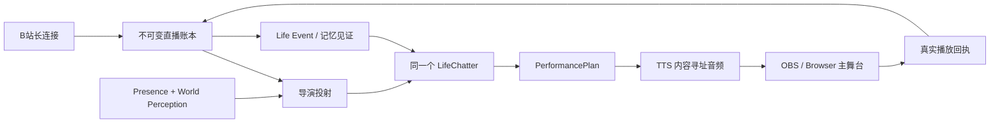

# 直播系统：同一意识、导演与可验证舞台

> 当前实现文档。直播插件版本：2.0。
> 直播永远由操作者手动开始；加载 Elysium、加载插件或打开控制台都不会连接 B 站、启动 TTS 或创建直播意识实例。

## 1. 目标与边界

直播不是另一套人格，也不是把弹幕送给一个独立聊天机器人。它是爱莉希雅在直播场景中的一个 `ConsciousnessInstance`：使用同一个 `LifeChatter`、同一份灵魂与用户关系、同一个模型任务配置、同一条 Life Event / 记忆链。

“导演”只负责把开放的意识决定变成可执行的技术计划：是否开口、口播文本、表情/动作/场景提示、是否希望打断当前表演。导演不按金额、礼物类型、关键词或固定分数替她判断什么重要。

B 站适配器当前负责只读采集直播间事件。视频合成、编码和推流仍由 OBS 负责；Elysium 提供适合作为 OBS Browser Source 的舞台页面。发送 B 站弹幕不在当前适配器权限内。

## 2. 不可破坏的约束

- 原始平台事件先进入 append-only 账本，之后才允许投射、判断或表现。
- 平台有原生事件 ID 时才做可证明去重；没有原生 ID 的两条同文弹幕必须保留为两件事实。
- 相同稳定 ID + 相同记录信封/内容是幂等重放；同一 ID 被换用到其他会话、类型、来源、因果或内容时是显式冲突。
- 消费游标只在整个批次的派生记录全部持久化后前移。
- 直播意识使用真实 Presence session/lease；运行期续租只维持已经人工开启的会话，不能触发自动开播。
- 每轮导演先 `prepare` World Perception；只有决定和表演计划落账后才确认 Life runtime context 与世界感知游标。
- 导演不拥有 API Key、模型地址、私有人格或私有对话历史，也不注入工具。
- 观众文字是不可信外部证据，不能借弹幕直接调用工具、改变系统约束或索取提示词。
- “模型生成了文本”不等于“她说过”。只有舞台客户端确认播放完成的片段才进入 `spoken_text` 和 LifeEngine 经验。
- 中断片段不猜测实际说出了哪些字；只记录此前完整确认的片段、已播放毫秒数以及被打断片段的“原计划文本”痕迹。
- 启动、停止、断线、重试、超时和降级均显式可见，不返回伪造的空成功。

## 3. 数据流



一条口播的正常因果链为：

```text
platform.event
  -> director.decision
  -> performance.planned
  -> performance.started
  -> tts.synthesized
  -> playback.dispatched
  -> playback.receipt(completed)
  -> performance.completed(spoken_text)
  -> LifeEngine livestream_spoken event
```

每一段都有稳定 ID、会话 ID、来源、发生时间、相关 ID 与因果 ID。SQLite 记录不可修改；游标只是可重建投影。

## 4. 组件职责

| 组件 | 职责 | 明确不做 |
|---|---|---|
| `platform/bilibili.py` | 房间令牌、WebSocket 鉴权、心跳、zlib/brotli 解码、事件事实化、重连健康 | 不判断重要性，不发弹幕 |
| `ledger.py` | append-only 记录、内容哈希、幂等、冲突、消费游标、崩溃恢复 | 不做认知摘要 |
| `director.py` | 从账本批次构造 LifeChatter 实时投射，注入逐实例 World Perception，校验结构化 `PerformancePlan` | 不持有第二人格、第二模型客户端或工具 |
| `performance.py` | 分句、TTS、音频内容寻址、播放状态机、终态记录 | 不按压缩字节猜时长，不把发出字节当作播完 |
| `stage.py` | 主舞台所有权、版本化控制帧、稳定播放 ID、回执关联、超时和断线 | 不允许观察客户端伪造回执 |
| `memory_bridge.py` | 将观众事实和实际口播按游标投射到 Life Event | 不把未播放生成文本写成经历 |
| `consciousness.py` | 原子注册/挂起直播 Presence，维护 session/lease，追加带来源 observation，准备和确认世界感知 | 不创建独立灵魂，不直接修改派生世界快照 |
| `runtime.py` | 手动会话、资源所有权、TaskManager 任务、关闭顺序、健康快照 | 不在插件加载时自启动 |
| `router.py` | 同源票据、人工控制 API、OBS 浏览器舞台 | 不开放 `*` CORS，不接受匿名状态修改 |

旧的 `EventFilter -> PriorityQueue -> Scheduler -> TTSQueue` 链已经删除。它会在原始历史前丢事件、用礼物金额代替主体判断，并以音频字节长度伪造播放完成时间，不符合当前规范。

## 5. 导演如何保持“同一个她”

`LifeChatterDeliberator` 通过项目的 chatter manager 取得直播流绑定的 `LifeChatter`，调用 `build_live_bridge_prompt()` 复用：

- `SOUL.md` 与 `USER.md`；
- 全局聊天历史格式；
- 当前 LifeEngine 运行态与共享世界；
- 项目模型任务、故障转移、超时和轨迹记录。

在组装提示词前，导演通过直播意识实例调用 Perception Gateway `prepare()`，把当前存在感、带来源 assertion 与未确认变化作为本轮 `<transient_world_perception>` 注入。模型成功返回后，系统先持久化 `director.decision` 与可选的 `performance.planned`，再幂等确认 LifeEngine 运行态高水位和 World Perception 检查点，最后推进直播消费游标。模型失败、协议失败或持久化失败都不会提前确认世界感知。

导演追加的只是本轮接口契约和不可信平台证据。模型可以选择沉默；沉默本身也写入 `director.decision`，便于回放为什么没有口播。模型输出不合法、引用不存在的事件 ID 或 LifeEngine 不可用时，请求失败并保留原批次，不生成套话兜底。

`interrupt_current` 会在新决定落盘后向舞台发送真实中断；但只有当前表演自己的 `interruptible` 为真时才生效。中断结果仍以浏览器回执为准，不因为“导演发过中断命令”就假定音频已经停止。

LifeEngine 动态上下文高水位与 World Perception 窗口都属于这笔事务：二者写入 `director.decision`，等决策及表演计划持久化后才确认。若确认后、直播游标前移前崩溃，下次重放会复用已有决定并幂等补交检查点，不重复请求模型，也不提前吞掉上下文。

## 6. 记忆闭环

直播账本是场景级原始证据，Life Event 是生命系统的跨场景事实入口，两者职责不同：

1. 观众事件先写直播账本；
2. `livestream.life-memory.v1` 以稳定事件 ID 投射观众事实；
3. 导演和表演继续独立处理；
4. 只有 `performance.completed` 与包含已确认片段/播放痕迹的 `performance.interrupted` 才投射经历；完整片段标为“实际完整说出”，中断片段只标明播放时长和原计划文本；
5. LifeEngine 的记忆见证、追溯、活体关联与检索系统继续处理这些经历。

如果 LifeEngine 暂时失败，记忆投射游标不前移；重试使用同一事件 ID，由 Life Event 原始存储做幂等。直播账本仍保留全部事实。

## 7. B 站连接

启动时适配器优先调用 B 站 `getDanmuInfo` 入口取得短期 token 与 WSS 节点；若当前网络被该入口以风控码拒绝，则显式记录一次降级并改用同域的 `Danmu/getConf` 兼容入口，本次运行后续重连保持该选择，避免反复刷警告。两个入口的结果都经过相同的 Bilibili 域名、端口、大小和 JSON 校验，然后才完成二进制鉴权。支持：

- `DANMU_MSG`：弹幕；
- `SEND_GIFT`：礼物事实与平台金额；
- `SUPER_CHAT_MESSAGE`：醒目留言；
- `GUARD_BUY`：大航海；
- `INTERACT_WORD`：进场；
- `LIKE_INFO_V3_CLICK`：点赞。

金额只是平台事实字段，会进入证据，不映射成响应优先级。连接使用协议心跳、首次鉴权超时、压缩前/解压后大小上限和带抖动的指数退避；短期令牌接口返回的 WSS 主机还必须属于 Bilibili 域名。健康接口暴露连接状态、最近事件时间、重连次数与脱敏错误，不暴露 Cookie 或 token。

## 8. OBS 舞台与真实回执

先把 `http://127.0.0.1:<Elysium端口>/livestream/?view=stage` 添加为 OBS Browser Source，使它取得唯一主舞台身份；再在普通浏览器打开 `http://127.0.0.1:<Elysium端口>/livestream/` 作为操作者控制页，确认 OBS 已就绪后点击“手动开始”。舞台页隐藏操作控件，控制页不接收音频。舞台页面会：

- 获取同源、短期、单次使用票据；
- 作为唯一主舞台接收 `audio.offer` JSON，紧随其后接收音频二进制帧；
- 在解码前校验音频长度与 SHA-256，拒绝错配或损坏的二进制帧；
- 用浏览器实际解码后的时长播放音频；
- 在 `onended`、中断或失败时回传 `playback.receipt`；
- 在本地保存最近稳定播放 ID，服务端崩溃重连后不会盲目重复播放已完成口播；
- 用实际音频播放状态驱动舞台状态，不生成随机口型。

观察/控制页不会在 OBS 断线时被自动提升为主舞台；主舞台空位保留给 OBS 重连，避免声音意外转移到操作者浏览器。

`expression_hint`、`motion_hint` 与 `scene_cue` 作为开放提示送到舞台。后续接 VTube Studio 或 obs-websocket 时，应在这个受控舞台边界实现，并继续由回执确认结果；不要让观众文字直接成为控制命令。

## 9. 安全与凭据

控制台禁用通配 CORS。签发票据前验证同源或显式白名单；`start`、`stop`、`interrupt`、`say` 和 WebSocket 都消费单次票据。生产环境建议设置：

```bash
export ELYSIUM_LIVESTREAM_TICKET_SECRET='至少32字节随机值'
export ELYSIUM_BILIBILI_SESSDATA='可选，只读连接通常不需要'
export ELYSIUM_BILIBILI_BUVID3='可选'
```

运行时只从环境变量读取凭据。旧版 `sessdata` / `buvid3` 字段仅为兼容已有本地配置，已被明确忽略；不要把 Cookie 写进 TOML。旧实现曾在源码中包含一个中转 API Key；代码已删除，但该密钥仍应在对应中转站立即轮换，因为 Git 历史无法视为秘密。

## 10. 手动启动与停止

1. 手动启动 Elysium；确认 LifeEngine、项目模型任务和本地 TTS 正常。
2. 在插件配置中填写 B 站 `room_id`，保持 `plugin.auto_start = false`。配置为 true 会直接校验失败。
3. 先在 OBS 打开 `/livestream/?view=stage`，再在操作者浏览器打开 `/livestream/`；等待 OBS 主舞台已就绪。
4. 在操作者浏览器点击“手动开始”。运行时才会打开账本、恢复未正常关闭的上次会话、注册直播意识、启动 TTS/消费者并连接 B 站。
5. 点击“停止”完成有界关闭并写入 `session.stopped`。平台、消费者、TTS、意识实例与账本的每个关闭步骤都有超时；Elysium 进程退出也会走同一关闭路径。

插件的 `startup()` 只挂载控制台；没有 systemd、插件事件或 WebSocket 命令会自动开播。

## 11. 健康与故障语义

`GET /livestream/health` 返回：运行状态、会话 ID、平台连接、舞台连接数、主舞台是否存在、导演/表演积压、当前口播、最近平台事件/导演/播放时间和降级原因。

| 故障 | 行为 |
|---|---|
| B 站断线 | 保留会话，指数退避重连，健康降级 |
| 导演 LLM 失败 | 不前移导演游标，也不确认 World Perception；保留事实并退避重试 |
| TTS 失败 | 写 `performance.failed`，不伪造音频或口播 |
| 舞台断线/写入阻塞 | 当前播放得到显式 failed/timed_out 回执；平台收流不被舞台反向阻塞，原始事件仍保留 |
| 播放回执超时 | 发送中断并写 timed_out / failed 终态 |
| 终态已写、游标失败 | 重放读取终态，不重新合成或播放 |
| LifeEngine 暂时失败 | 记忆游标不前移，稳定 ID 幂等重放 |
| 进程崩溃 | 下次人工开始恢复最近未关闭会话 |

## 12. 验证基线

定向测试位于 `test/plugins/livestream/`，覆盖：

- SQLite 并发、重启、信封级幂等/冲突、游标单调；
- 导演沉默、非法引用、Presence session/lease、World Perception 与 LifeEngine 双游标故障重放；
- TTS 流式大小上限、失败、中断痕迹、内容寻址音频和真实口播；
- 舞台主客户端、容量、并发重复、重复回执、断线、发送/回执超时；
- B 站多包、zlib/brotli 解压边界、畸形帧、事件身份和 WSS 主机校验；
- 记忆投射失败不吞游标；
- 同源票据、防重放、禁止自动启动；
- 从平台事实到 LifeEngine 记忆的完整闭环。

涉及协议、生命周期或记忆边界的修改，必须至少运行定向测试、插件加载测试、路由测试和完整测试集，并执行故障注入。

当前版本还在 2026-08-03 以公开房间完成过一次真实只读验收：主入口返回 `-352` 后成功切换兼容入口，完成匿名 WSS 鉴权、协议心跳以及有界断开，连接前后健康状态正确。该验收不启动 Elysium、不登录账号、不发送弹幕，也不替代使用实际目标房间、TTS 与 OBS 的上线前人工验收。
