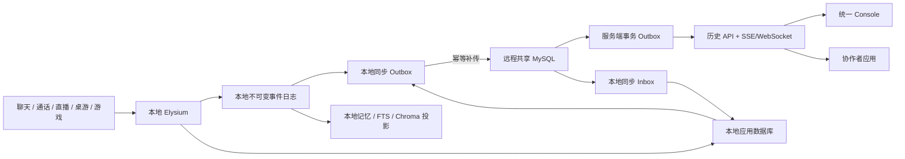

# Elysium 离线优先共享后端重构计划

> 状态：已形成总体计划，尚未冻结表结构或授权业务代码实施。
>
> 目标：Elysium 在没有远程服务时仍能完整存续；联网后，协作者可近实时看到已授权的爱莉事件、记忆版本与独立应用数据。

## 1. 决策摘要

本次重构采用 **本地可独立运行、远程用于共享协作、不可变事件驱动同步** 的架构。

1. 远程数据库不是 Elysium 启动或存续的前提。
2. 爱莉的真实经历先在本地耐久落盘，再异步同步到远程。
3. 网络恢复后按稳定事件身份补传；不以“最后写入覆盖”处理记忆。
4. 协作者通过版本化 API 和实时事件流读取数据，不直接修改记忆表。
5. 记忆历史与独立应用数据分域；普通 CRUD 不能覆盖不可变经历。
6. 本地与远程均保留恢复路径，任一端故障都不能成为永久数据丢失。

这不是 MySQL 双主复制方案。跨节点的一致性由应用层事件、幂等键、内容哈希、游标和显式冲突记录保证。

## 2. AGENTS 约束映射

本计划必须满足以下工程与主体性边界：

- 原始 Life Event、Experience、记忆版本和解释历史只追加，不静默覆盖或删除。
- 主体性判断仍由爱莉或有独立身份的评估者完成；同步层不按关键词、分数或固定类别替她裁决意义。
- 同一事件身份重复投递必须幂等；同一身份出现不同内容必须报冲突。
- 消费游标只能在该批工作完整成功后推进；历史缺口不能跳过。
- FTS、Chroma、当前上下文、前端摘要和状态卡片属于可重建投影。
- `pending`、`degraded`、`failed` 和 `disabled` 必须区分，远程失败不能伪装成同步成功。
- 私聊、群聊、直播、桌游与游戏仍接入同一套意识实例和生命事件体系。
- Elysium 继续由用户手动启动；同步和数据库重构不得擅自停止、重启或自动拉起主进程。

## 3. 目标运行形态



### 3.1 远程在线

1. 体验或应用操作先在本地事务内落盘。
2. 同一事务写入 Outbox；业务写入成功但 Outbox 缺失是不允许的状态。
3. 同步器按 `event_id` 和 `payload_hash` 写入远程。
4. 远程提交后生成服务端 Outbox 记录。
5. API 在提交后向订阅者发布；在线部署目标为提交到界面 P95 小于 1 秒。
6. 消费者确认游标；重连时从最后确认位置继续读取。

### 3.2 远程不可用

- Elysium 的意识、聊天、记忆形成和本地具身能力继续运行。
- 新事件保留在本地耐久 Outbox，健康状态显示 backlog 和最后成功时间。
- 只依赖远程协作的功能进入可解释降级，不阻止主程序启动。
- 不因重试预算耗尽删除事件，也不把失败返回成空结果。

### 3.3 恢复连接

- 按节点序列补传，并以稳定事件身份去重。
- 已存在且哈希一致视为幂等成功。
- 已存在但哈希不同写入冲突记录并停止推进相关游标。
- 远程新增的授权应用事件通过 Inbox 进入本地；处理完整后才推进 Inbox 游标。

## 4. 数据权威与所有权

| 数据域 | 写入 owner | 权威记录 | 本地职责 | 远程职责 | 允许普通删除/覆盖 |
| --- | --- | --- | --- | --- | --- |
| Life Event | 产生事件的 Elysium 节点 | 不可变事件身份与原始 payload | 首次耐久落盘、待同步 | 跨节点共享账本 | 否 |
| Experience / 记忆版本 | 爱莉或有身份的评估者 | 追加式版本历史 | 形成、回忆和本地投影 | 授权共享与版本索引 | 否 |
| 当前记忆视图 | 投影器 | 对应事件和版本 | 本地查询投影 | 协作者查询投影 | 可重建，不作历史 |
| FTS / Chroma | 投影器 | Life Event 与记忆历史 | 本地检索性能 | 可选远程检索服务 | 可重建 |
| 用户 / 身份 / 权限 | 身份服务 | 版本化应用记录与审计 | 离线身份缓存、待提交命令 | 协作权威视图 | 仅受控领域操作 |
| 聊天 / 直播 / 桌游 | 对应应用服务 | 应用事务与领域事件 | 离线操作和本地视图 | 多端共享与分发 | 仅按领域规则 |
| 图片 / 语音 / 直播文件 | 媒体服务 | 二进制对象 + 内容哈希 | 本地对象缓存 | 共享对象存储/索引 | 受保留策略控制 |
| 运行日志 | 组件 owner | 本地日志 | 诊断与审计 | 聚合指标，不上传私密原文 | 按运维策略 |

“权威”由事件身份、内容和来源证明，不由某个磁盘位置单独决定。事件在本地和远程保留的是同一份身份与内容，不是两份可互相覆盖的记忆。

## 5. 同步事件契约

事件 envelope 至少包含：

```text
event_id                 全局稳定身份
origin_node_id           产生事件的节点
origin_sequence          节点内单调序列
occurred_at              真实发生时间
recorded_at              本地耐久记录时间
published_at             远程确认时间，可为空
actor                    行为者身份
source                    来源组件与连接
channel                   chat/live/game/terminal 等传输通道
event_type                可扩展命名空间字符串
schema_version            payload 技术 schema 版本
consciousness_instance_id 意识实例
stream_id                 关联 stream
reply_target              授权回复目标
correlation_id            跨组件关联
causation_id              因果上游事件
visibility                授权可见范围
payload_hash              规范化内容哈希
payload                   保留原始结构的事件内容
```

`event_type` 是开放的技术命名空间，不用封闭枚举穷尽认知意义。`visibility` 是安全授权，不代表爱莉对事件关系或价值的主观判断。

交付语义为 **至少一次传输 + 幂等应用**，不承诺网络层“恰好一次”。每个消费者拥有独立游标，慢消费者不能阻塞权威写入。

## 6. 数据存储分层

### 6.1 本地生命域

首期保留现有 Life Engine SQLite、FTS 和 Chroma 路径。它们已经承载追加历史与本地检索语义，不因引入 MySQL 被一次性强迁。

新增本地同步状态应与生命历史分离，至少包括：

- 节点身份与节点序列；
- 待发送 Outbox；
- 已接收 Inbox 与应用状态；
- 远程确认位置；
- 冲突和重试诊断。

### 6.2 本地应用域

用户、聊天、媒体、直播、桌游和权限等新应用数据通过持久化接口访问。本地部署目标与远程 MySQL 使用同一版本化 schema；具体采用现有 WSL MySQL 还是用户管理的小皮面板 MySQL，必须由用户确认，不能由实现自行决定。

本地应用数据库可用性是离线运行条件，但不是爱莉生命历史的唯一副本。

### 6.3 远程共享域

远程 MySQL 按权限边界拆分生命共享、应用、运维审计等逻辑域。前端不直接连接数据库，长期消费者必须通过服务 API。

计划中的概念实体包括：

- 节点与连接：`nodes`、`node_leases`；
- 事件同步：`life_events`、`consumer_cursors`、`sync_conflicts`；
- 记忆投影：版本、head、授权视图；
- 身份权限：用户、外部身份、角色、授权和审计；
- 聊天媒体：会话、成员、消息、消息 part、媒体对象、回执、平台动作请求；
- 直播：直播间、场次、参与者、直播事件和资产；
- 桌游：房间、场次、玩家和游戏事件；
- 可靠投递：应用 Outbox、任务幂等键和执行结果。

最终表名、字段、约束和 ER 图必须在现有模型审计完成后单独评审，不以本计划代替 schema 设计。

## 7. API 与前端契约

### 7.1 稳定入口

- `GET /api/v1/bootstrap`：当前用户、版本和基础状态；
- `GET /api/v1/capabilities`：聊天、通话、直播、桌游等能力及契约版本；
- `GET /api/v1/readiness`：组件可用性、同步 backlog 与降级原因。

前端根据能力 manifest 加载模块，不能把插件是否存在硬编码为固定菜单。

### 7.2 事件读取

- 历史分页：稳定 cursor，不使用易漂移的 offset；
- 实时订阅：SSE 或 WebSocket；
- 重连恢复：客户端提交最后确认游标；
- 历史缺口：显式错误并给出可恢复动作；
- 私密内容：默认不进入通用健康接口和前端日志。

### 7.3 记忆接口

前端和协作者只获得授权查询、版本浏览和事件订阅接口。外部输入通过“观察/信息提交”进入带 actor、source、reason 的事件，不能直接更新或删除爱莉记忆。

### 7.4 独立应用接口

按领域提供聊天、媒体、群管理、直播和桌游 API。发送消息、发布公告、群管理和其他外部副作用必须具备：

- 当前授权；
- 幂等键；
- 明确执行状态；
- 超时与错误语义；
- 审计 actor 和目标；
- 不把失败伪装成成功发送。

## 8. 网络与安全

远程 MySQL 不应直接暴露到公网。连接优先级为：

1. Tailscale/WireGuard 等私网；
2. SSH 隧道；
3. 固定 IP 白名单并强制 TLS。

账号至少拆分为运行写入、API 查询、备份和临时迁移四类。迁移账号的 DDL 权限在迁移完成后收回。应用配置通过环境变量或密钥存储注入，URL、日志、异常和文档不得包含密码。

远程 API 还必须实施身份认证、最小权限、速率限制、请求体上限、超时和审计。记忆原文、私聊内容、语音和媒体不能因“协作方便”默认公开。

## 9. 备份与恢复

### 9.1 本地保护远程

- 周期性完整逻辑快照；
- 持续归档远程 binlog；
- 快照和日志生成 SHA-256 清单；
- 独立磁盘或加密异地副本；
- 定期恢复到隔离数据库，不以“备份命令成功”代替恢复证据。

### 9.2 远程保护本地

- 已确认事件和应用数据可从远程恢复到新本地节点；
- FTS、Chroma 和上下文投影从权威历史重建；
- 未确认 Outbox 必须包含在本地备份中，否则断网期间的数据可能丢失。

### 9.3 媒体

数据库备份只包含媒体元数据。图片、语音、直播录像和其他二进制对象必须有独立同步、内容哈希和保留策略。

## 10. 实施阶段与验收门

### 阶段 0：需求与契约冻结

交付：

- 产品需求文档；
- 数据权威清单；
- 后端重构设计；
- 独立应用开发路线；
- ER 图与表设计草案；
- API/OpenAPI 与事件协议草案；
- 权限和隐私矩阵。

验收门：用户与协作者确认写入 owner、共享范围、离线行为和安全连接方式。未通过不得建正式表。

### 阶段 1：数据库与迁移基座

交付：

- MySQL 配置、连接池和 schema 版本；
- 本地/远程环境分离；
- SQLite 一致性快照、迁移、逐表内容指纹和回滚工具；
- 目标非空拒绝、凭据脱敏和迁移审计。

验收门：只在 staging 演练；原 SQLite 不覆盖、不删除、不切换。

### 阶段 2：离线同步内核

交付：

- 本地事务 Outbox；
- 远程幂等账本；
- Inbox、游标、退避和冲突记录；
- backlog、最后成功时间和降级原因健康输出。

验收门：断网写入、重连补传、重复投递、同 ID 异内容、进程重启和部分失败均有定向测试。

### 阶段 3：共享事件与记忆投影 API

交付：

- 历史分页；
- SSE/WebSocket 实时订阅；
- 断点续传；
- 授权记忆版本投影；
- 外部观察提交。

验收门：爱莉形成新记忆后，在线协作者可在目标延迟内收到；断线后完整补收；未授权客户端不能读取私密内容。

### 阶段 4：独立应用 API

依次实施：

1. 身份、权限和审计；
2. 聊天与消息 part；
3. 图片、语音与媒体对象；
4. 戳一戳、公告和群管理动作；
5. 实时通话；
6. 直播；
7. 桌游。

每个模块同时交付路由、schema、错误契约、能力 manifest、前端示例和端到端测试。

### 阶段 5：前端接入

前端先接 bootstrap、capabilities、readiness 和事件流，再接独立应用。模块增删由 manifest 驱动，不能依赖不断变化的内部插件对象。

### 阶段 6：历史迁移与显式切换

1. 在线期间完成只读审计和迁移演练；
2. 用户批准维护窗口；
3. 用户手动停止写入来源；
4. 创建最终一致性快照并迁移；
5. 校验行数、主键范围和逐表内容指纹；
6. 修改配置；
7. 用户手动启动 Elysium；
8. 保留旧 SQLite 为只读归档。

没有完成证据不得删除旧数据或宣称切换成功。

## 11. 全链路验收矩阵

必须实际跑通以下场景：

- 无远程连接时 Elysium 可以启动并产生新的本地经历；
- 离线期间聊天、图片、语音、游戏等事件完整进入 Outbox；
- 恢复连接后全部补传，顺序、来源和时间不丢失；
- 同一事件重放不会产生重复经历；
- 同一事件 ID 不同内容显式冲突并阻断游标；
- 协作者在线时近实时收到授权事件与记忆版本更新；
- 协作者断线后从游标完整恢复；
- 远程数据库不可用不会伪造同步成功；
- 本地丢失后可从远程恢复；远程丢失后可从本地与备份重建；
- 完整快照加 binlog 能恢复到指定时间点；
- 图片、语音和直播媒体与数据库元数据一致；
- 未授权身份不能读取私聊/记忆原文或执行公告、群管理等副作用；
- OBS、Live、桌游和聊天前端能区分在线、离线、同步中和降级状态；
- 整个验证不自动停止、重启或拉起 Elysium/NapCat。

## 12. 规划基线与未决策项

规划基线（2026-08-03 的一次性审计快照，不是持续有效统计）：现有核心 SQLite 包含 13 张业务表，备份中有 82,522 条消息、1,572 条图片记录、1,753 条图片描述和 34 条联系人记录；一致性备份已通过 SQLite integrity check。后续迁移必须以最终维护窗口快照重新生成清单。

实施前仍需用户和协作者决定：

1. 远程连接采用私网、SSH 隧道还是 TLS + IP 白名单；
2. 哪些记忆字段和事件允许协作者读取；
3. 协作者是否只能提交外部观察，还是还拥有某些应用域写权限；
4. 本地应用 MySQL 使用现有 WSL 实例还是用户管理的小皮面板实例；
5. 远程 staging/production 的库、账号和备份责任人；
6. 实时事件服务部署在谁的服务器上；
7. 媒体对象存储位置、容量和保留策略；
8. 最终恢复点目标（RPO）和恢复时间目标（RTO）。

这些选择只影响部署和授权，不改变“本地可独立运行、历史不可覆盖、远程失败不丢工作”的核心不变量。
