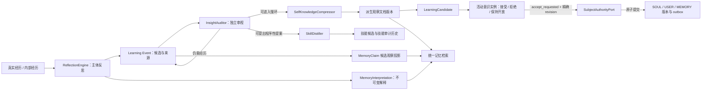

# 自学习与自我解释系统

本文描述当前 `life_engine` 的学习系统。它与[生命记忆系统](生命记忆系统.md)共同工作：记忆系统保存经历、版本、解释与回忆痕迹；学习系统从这些经历中形成可复核的观察、候选理解和技能提案。`SOUL.md + USER.md + MEMORY.md` 是唯一主体前缀权威，学习产物在活动意识实例明确接受并经统一 revision CAS 提交前，始终位于主体权威之外。

## 1. 设计契约

### 1.1 零规则

代码只负责保存事实、编排任务、提供完整上下文和执行明确决定，不替主体作认知判断：

- 不以关键词、主题字符串、相似度或阈值判断两条理解是否相同。
- 不用固定类别枚举限制主体能注意到什么。
- 不按固定条数裁剪反思、反例、观察或解释。
- 不因模型超时、返回损坏或评估失败而默认接受候选。
- 不根据来源名称自动宣告内容为真。
- 不自动激活技能；系统只让主体知道技能存在，是否使用由当下推理决定。

模型提示可以给出思考建议和输出协议，但代码不得把建议变成隐藏的认知结论。

### 1.2 认知阈值与运行预算分离

系统保留批量大小、调用间隔、超时等运行参数，用于控制并发和成本。这些参数只能回答“这轮处理多少工作”，不能回答“多少证据才算真”“最多能形成多少理解”或“应该修改几处”。

### 1.3 不覆盖历史

经历、反思、审计、版本与关系都留下可追溯记录。当前观点只是某一时刻生效的头指针，不会改写旧版本。

## 2. 总体流程

这条链路不是一次性的“总结器”，也不是后台自动改写人格的管道。新的经历可以补充旧理解、反驳旧理解，也可以让主体主动把既有理解拿回来重新审视；代码只保存候选、安排独立检查和执行可验证的明确决定。

## 3. 反思：从经历到候选解释

实现：`plugins/life_engine/learning/reflection.py`

`ReflectionEngine` 接收完整的交互或内部经历，并向主体展示已有理解及其精确 `insight_id`。模型可以：

- 输出任意自然命名的理解；
- 明确填写 `reinforces=<insight_id>`，把本次经历作为旧理解的新证据；
- 不填写 `reinforces`，保留为新的解释候选；
- 输出空列表，表示这次没有值得抽象成长期理解的内容。

只有模型明确给出 `reinforces` 时，系统才会把证据挂到旧理解上。代码不会用 `topic_key`、词面重合或向量相似度替模型合并。`topic_key` 是历史兼容与展示字段，不具有自动归并权力。

每次真实反思还会写入不可变的 `MemoryInterpretation`。因此，即使没有形成新的 `Insight`，也能追溯“她当时如何解释这段经历”。

## 4. 洞察账本与证据

实现：

- `plugins/life_engine/learning/models.py`
- `plugins/life_engine/learning/store.py`
- `plugins/life_engine/learning/epistemic.py`

`InsightStore` 保存当前快照，同时把状态变化写入 append-only 审计流。相同 ID 的完全相同重放是幂等的；同一 ID 出现不同内容会被拒绝。不同 ID 的相似文本不会被静默合并。

证据来源不会获得代码预设的高低权重；主体主动质疑只追加完整反例，不按反例数量自动降低置信度或改变状态。后续变化必须来自新的独立审视或主体的明确决定。

主要状态用于描述流程位置，而不是事实等级：

- `candidate`：等待独立审视；
- `under_review`：本轮正在审视；
- `validated`：独立审视认为可以进入慢环整合；
- `rejected`：审视认为当前表述不成立；
- `archived`：已完成当前流程，但历史仍保留。

洞察投影为 `MemoryClaim` 时仍是候选解释或证据，不因“通过学习审计”自动成为绝对事实。认知权威由开放文本记录；来源名称不映射为确认级别。

## 5. 独立审视

实现：`plugins/life_engine/learning/auditor.py`

`InsightAuditor` 为每条候选调用独立模型视角，完整查看 claim、边界、证据、反例和相关上下文。模型自行判断：

- 当前证据是否足以支撑这条具体表述；
- 是否存在过度泛化或遗漏的反例；
- 是验证、拒绝、继续收集经历，还是修正后再审。

代码不以证据条数、时间跨度或置信分数自动晋级，也不把批量内其他候选的结论套到当前候选。模型不可用、JSON 无效或 verdict 不在协议中时，本轮失败并保留待处理状态，不产生默认裁决。

审计记录保存完整理由，不截断为摘要。审计是一个可追溯的解释步骤，不是真理机器。

## 6. 派生观察与主体接受

实现：`plugins/life_engine/learning/knowledge.py`

`SelfKnowledgeCompressor` 向整合模型提供：

- 当前完整自我认知文档；
- 本轮所有可整合的 validated 洞察；
- 全部 rejected 反例；
- 所有曾进入旧版本、后来又被主体拿回重想的理解。

整合模型根据理解的实际依赖关系决定修改范围。旧配置中的 `max_edits` 仅为兼容保留，不再限制认知修改数。

每个新提案都会保存为不可覆盖版本。独立 selection gate 只能回答“是否把该版本列为更值得主体复核的学习提案”，不能授予主体权威。门控失败、超时或返回损坏一律不提升学习投影，但提案版本仍可审计。

版本记录中的 `edit_count` 是根据新旧文档 diff 计算出的实际连续变化区数量，只是审计元数据，不是修改上限。

在 selectable storage 模式中，通过 selection gate 的派生文档会生成精确 `LearningCandidate`，记录候选 ID、候选 revision、正文 SHA-256、来源 occurrence、目标主体文档和当时的统一主体 revision。它不会自动写入 `MEMORY.md`，也不会因 gate 推荐而自动接受。legacy local 兼容模式没有事务化 SubjectAuthority，因此只保留非权威派生版本，不伪造一个不安全的接受入口；完整接受链需在经批准切换 selectable local/MySQL 后使用。

主体接受使用 `nucleus_list_subject_candidates`、`nucleus_read_subject_candidate` 和 `nucleus_decide_subject_candidate`：

- actor 从当前运行 stream 绑定的活动 `ConsciousnessInstance` 获取，工具参数不能伪造 actor；
- 接受必须带上读取候选时看到的候选 revision/hash 和统一 `SOUL+USER+MEMORY` revision；
- 主体可以接受建议原文，也可以提交自己最终重写后的完整目标文档；候选 hash 与接受内容 hash 分别保留；
- 拒绝和保持开放只追加决定事件，绝不修改主体文件；
- 接受先写 `accept_requested` 意志证据，只有 `SubjectAuthorityPort.accept_candidate()` 成功后才投影为 `committed`。

`SubjectAuthorityPort` 在同一个 fenced UoW 内验证 actor 仍 active 且租约有效、候选和决定 occurrence 的不可变证据、三份主体文档精确字节 digest、目标文档 head CAS，并原子追加文档版本、head event、authority decision 和 projection outbox。revision 冲突时 fail closed，不自动 rebase、合并或改写；候选保持开放，等待该意识实例重读后重新决定。成功提交由 outbox 投影到工作区并刷新主体上下文缓存。

主体可以主动 reconsider 已验证或已归档的理解。重新审视不会删除原证据、审计历史或曾进入的学习版本；新解释形成新的候选和决定链，因此可以还原“以前怎样理解、为何改变、后来怎样理解”。

### 6.1 主体文档复盘机会

`LearningScheduler` 还会按纯工程时间提供低频复盘机会，默认 `MEMORY.md` 每 7 天、`SOUL.md` 与 `USER.md` 每 30 天检查一次。时间间隔只回答“是否可以再次邀请她看一眼”，不表示内容过期、有错、必须压缩或应该改变。一次邀请后默认 24 小时不重复出现；活动意识可以选择：

- `status`：读取三份文件的精确内容 SHA-256、统一主体 revision、上次复盘与下次时间点；
- `unchanged`：基于刚读取的文件 hash 和统一 revision，明确记录“当前版本保持不变”；
- `snooze`：把下一次邀请延后，仍不触碰正文；
- `propose`：在 Subject Authority 已就绪时提交自己写出的完整新版本候选，之后仍须通过独立候选读取与决定工具才能接受。

复盘工具从当前 stream 绑定活动 `ConsciousnessInstance`，调用参数不能伪造 actor。`unchanged`、候选、拒绝、保持开放和接受都保留 occurrence、actor、revision、hash 与时间；健康投影只暴露 content-free 元数据。后台调度器、压缩器和独立 gate 都没有 `propose` 或 `accept` 权力。

当 `storage.enabled=false` 时，复盘邀请仍可工作，`unchanged` / `snooze` 会进入 `.life_learning/subject_reviews.jsonl` 追加证据；`propose` 与接受必须返回 `SubjectAuthorityMigrationRequired`。系统不得退回通用 file 工具、shell 或直接覆盖 Markdown。生产切换仍是独立的数据冻结、复制、校验和用户手动重启流程。

## 7. 技能：显式归属与双重审视

实现：

- `plugins/life_engine/learning/skill_distiller.py`
- `plugins/life_engine/learning/skill_store.py`

技能是“我怎么做”的程序性记忆。蒸馏模型会看到全部现有技能的：

- 精确 `skill_id`、名称、描述与完整 instructions；
- 全部来源洞察；
- 全部使用观察；
- 全部曾被拒绝的修改。

模型必须明确选择：

- 填写一个现有 `target_skill_id`，精炼该技能；或
- 把 `target_skill_id` 留空，并为确实新的技能给出主体自己选择的名称。

编排代码不再按 `topic_key`、名称子串或描述关键词寻找技能，也不会在模型漏写名称时生成兜底名称。模型指向不存在的 ID 时，本轮拒绝，不能偷偷改成“创建新技能”。

现有技能修改和新技能创建都先经过独立 introspective gate，但 gate 结果只作为 `gate_recommended` 来源证据，不能直接修改 Skill。调用失败或返回无法解析时不推荐；无论是否推荐，候选都保留精确 revision/hash、完整提案、来源洞察和 gate provenance，洞察继续留在待处理位置。

活动意识实例通过 `nucleus_list_skill_candidates`、`nucleus_read_skill_candidate` 与 `nucleus_decide_skill_candidate` 明确接受、拒绝或保持开放。决定必须绑定当前 stream 的 actor、精确候选 revision/hash 和统一主体 revision；stale revision、非 active actor 或持久化失败均 fail closed。只有接受提交成功后才更新 Skill 投影并归档来源洞察；拒绝提案会保留为可回放历史。新 Skill 没有由主体明确给出 maturity 时保持空值，代码不会替她宣告“已内化”或“成熟”。

技能目录只让主体知道自己有哪些做事方式。加载具体技能与是否采用它，必须来自主体当下的选择，不由关键词触发器自动决定。

## 8. 与活体记忆和检索的连接

学习系统不是记忆的旁路：

- 反思结果进入 `MemoryInterpretation`，和来源经历建立不可变链接；
- 洞察及审计证据投影到认识论账本，但保留其候选性质；
- 自我认知文件的每次变化进入 artifact version / derivation 历史；
- 统一检索同时搜索经历见证、文档、claims 与 interpretations，并返回来源；
- 一次回忆共同暴露的记忆会形成 recall trace 与共回忆超边，供后续上下文关联使用。

共回忆增强影响未来“更容易想起什么”，不改变内容真假。随机邻居选择记录上下文与 seed，可重放、可解释。详细数据模型和健康检查见[生命记忆系统](生命记忆系统.md)与[活体记忆迁移指南](../operations/living_memory_migration.md)。

## 9. 调度与故障语义

实现：`plugins/life_engine/learning/scheduler.py`

调度器只决定何时尝试反思、认识论回填、审计、整合、技能蒸馏、指标快照与陈旧观察。计数和时间间隔是工作调度条件，不是认知结论。

故障处理遵循以下原则：

- LLM 暂时失败：记录失败并等待下轮，不默认通过。
- 反思请求：先进入有界持久队列，再调用模型；失败保留任务并按有界指数退避重试，重启后继续。
- 输出协议损坏：拒绝本轮结果，不从文本猜 verdict 或目标技能。
- 持久化失败：不归档来源洞察，避免出现“结果没写入、任务却已完成”。
- 阶段隔离：每个维护阶段独立记录 `started/succeeded/failed`；一个阶段失败不阻止后续阶段。
- 可观测性：维护记录只含阶段、时间、耗时、待处理数量、异常类型与基于异常类型的 fingerprint，不写提示词、候选正文、凭据或异常消息。
- 已写入经历后重试：按稳定 ID 读取已有经历继续见证，不因幂等插入返回 existing 就跳过解释。
- 数据读取失败：保护原文件，禁止用空快照覆盖损坏但仍可恢复的数据。

## 10. 存储、事务与可追溯性

### 10.1 兼容本地模式

`storage.enabled=false` 时继续使用 `data/life_engine_workspace/.life_learning/`：

| 路径 | 作用 |
| --- | --- |
| `insights.json` | 洞察当前快照 |
| `insights_audit.jsonl` | 洞察状态与审计的 append-only 轨迹 |
| `state.json` | 调度位置和最后运行时间 |
| `validation_experiments.json` | 主体发起的验证实验 |
| `skills.json` | 技能当前快照 |
| `skills_audit.jsonl` | 技能创建、修改、拒绝与成熟度轨迹 |
| `knowledge/self_knowledge.md` | 当前学习观察投影，不是主体权威 |
| `knowledge/manifest.json` | 学习观察版本头与来源索引 |
| `knowledge/vN.md` | 不可变历史版本 |
| `maintenance_runs.jsonl` | 有界、content-free 的维护阶段运行记录 |
| `subject_reviews.jsonl` | 迁移前的主体复盘选择追加证据；记录 actor/revision/hash/occurrence、选择与理由，不保存候选正文，也不是写入权威 |

兼容模式保留既有部署行为，但 JSON 快照与 JSONL 审计无法跨文件形成原子事务；损坏读取会显式阻止覆盖，不能伪装成空数据。它是迁移前兼容面，不是 selectable storage 的双写副本。

### 10.2 selectable local / MySQL 模式

`storage.enabled=true` 时，Learning 从 `LifeEngineService` 唯一拥有的同一个 `StorageBackendRuntime` 获取 `LearningStorePort`；不得自行打开/关闭 runtime，不得回退或双写 `.life_learning`。业务启动固定使用 `initialize_schema=false`，缺表或 runtime 未注入必须 fail closed。

Learning v1 存储由两类表构成：

- `learning_events`：只追加 occurrence，保存 kind、发生/记录时间、source、actor、统一主体 revision、provenance、payload 和规范化事件 SHA-256；同 occurrence 同字节幂等，不同字节冲突；数据库 trigger 禁止 update/delete；
- `learning_projections`：可重建当前投影，以 `revision + source_frontier` CAS 更新，记录 schema/projector version、`ready/rebuilding/failed` 和投影 SHA-256。

一次 `commit()` 可原子提交一组不可变事件及其派生投影。稳定分页使用单调 position；selected 兼容层在第一次 `await` 前分离本轮 buffer，提交过程中到达的新同步 mutation 会留在下一轮，不会被已完成 flush 清空。health 只报告事件 frontier、投影 revision/rebuild 状态、pending buffer 和失败类型，不返回正文或凭据。

Subject Document 不属于 Learning store。Learning 只把候选和决定保存在自己的账本；真正修改 `SOUL/USER/MEMORY` 必须消费同一 runtime 中已经打开的 `SubjectDocumentStorePort` 高层权威接口。

## 11. 迁移与恢复

旧版 `SemanticMatcher`、embedding/Jaccard 自动去重、topic 子串技能匹配和固定 `max_edits` 认知限制已经移除。迁移不会删除旧洞察或 `topic_key`；这些字段继续作为历史内容存在，但不再触发自动合并。

旧配置中的 `skill_max_edits` 仍可被解析，当前实现会忽略它，以避免旧配置导致启动失败。后续可以在完成配置弃用周期后移除该字段。

`scripts/migrate_life_learning.py` 只从完整生命域快照读取 `.life_learning`，逐文件核对 snapshot manifest，并把每个旧文件的精确原始字节拆成不超过 1 MiB 的有界 immutable chunk events；随后写入 manifest、完成事件和可重建语义投影。校验必须证明文件集合、大小、逐文件 SHA-256、每个 chunk hash、重组字节和完成事件完全一致。

迁移使用独立 copy authority 和 `CANDIDATE_COPY` runtime，只允许写隔离 MySQL 候选；不会修改 `storage.enabled`、注册/激活正式 generation、删除源文件或操作 Elysium 进程。反向导出只允许写入此前不存在的新目录，先写 incomplete 标记，验证全部重组字节后才完成。正式切换仍须遵循[生命域存储快照与权威切换运行手册](../operations/life_storage_backend_runbook.md)。

## 12. 验证要求

修改这条链路至少需要覆盖：

- 相似文本不会自动合并；只有显式 `reinforces` 才补充旧证据；
- 每次反思都会留下不可变 interpretation；
- 审计失败不会自动晋级；
- 反思 LLM 失败后任务仍在有界队列，重启可继续，成功后才删除；
- 任一维护阶段失败不阻塞后续阶段，并留下 content-free 运行证据；
- 全部反例、观察和历史技能进入整合上下文；
- 技能只接受精确 target ID，不存在的 ID 不创建兜底技能；
- 新技能也经过 introspective gate；
- 门控解析失败默认拒绝；
- 学习观察 diff 只记录实际变化，不限制变化；
- 压缩结果只生成可审计主体候选，不直接写 `SOUL/USER/MEMORY`；
- 通用 file 工具拒绝三份主体权威文件，symlink 也不能绕过；通用 shell 在 Bubblewrap 只读挂载中运行，缺少隔离器时 fail closed；
- 复盘时间点只生成邀请；保持原样与稍后再看可审计，legacy local 的新版本候选必须明确拒绝而不能降级写入；
- 接受必须验证活动 actor、候选 revision/hash 和统一主体 revision，CAS 冲突不得伪装成功；
- local/MySQL adapter 通过同一幂等、冲突、CAS、分页、重建与 content-free health 合同；
- legacy 迁移和反向导出逐字节可重现，源目录保持不变；
- 重试不会在 Experience 已存在时跳过见证；
- 版本、来源、回忆轨迹和关联投影可重建。

提交前应运行 life_engine 全量测试、关键静态检查和数据库只读健康审计；不得为了让测试通过而改写真实数据。
