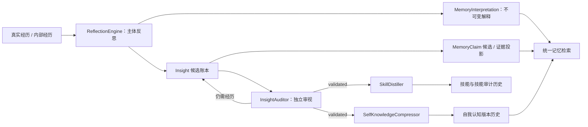

# 自学习与自我解释系统

本文描述当前 `life_engine` 的学习系统。它与[生命记忆系统](生命记忆系统.md)共同工作：记忆系统保存经历、版本、解释与回忆痕迹；学习系统从这些经历中提出可复核的理解，并把主体认可的理解整合进自我认知与技能。

## 1. 设计契约

### 1.1 零规则

代码只负责保存事实、编排任务、提供完整上下文和执行明确决定，不替主体作认知判断：

- 不以关键词、主题字符串、相似度或阈值判断两条理解是否相同。
- 不用固定类别枚举限制主体能注意到什么。
- 不按固定条数裁剪反思、反例、观察或解释。
- 不因模型超时、返回损坏或评估失败而默认接受候选。
- 不根据来源名称自动宣告内容为真。
- 不自动激活技能；系统只让主体知道技能存在，是否使用由当下推理决定。

模型提示可以给出思考建议和输出协议，但代码不得把建议变成隐藏的认知结论。

### 1.2 认知阈值与运行预算分离

系统保留批量大小、调用间隔、超时等运行参数，用于控制并发和成本。这些参数只能回答“这轮处理多少工作”，不能回答“多少证据才算真”“最多能形成多少理解”或“应该修改几处”。

### 1.3 不覆盖历史

经历、反思、审计、版本与关系都留下可追溯记录。当前观点只是某一时刻生效的头指针，不会改写旧版本。

## 2. 总体流程

这条链路不是一次性的“总结器”。新的经历可以补充旧理解、反驳旧理解，也可以让主体主动把已经生效的理解拿回来重新审视。

## 3. 反思：从经历到候选解释

实现：`plugins/life_engine/learning/reflection.py`

`ReflectionEngine` 接收完整的交互或内部经历，并向主体展示已有理解及其精确 `insight_id`。模型可以：

- 输出任意自然命名的理解；
- 明确填写 `reinforces=<insight_id>`，把本次经历作为旧理解的新证据；
- 不填写 `reinforces`，保留为新的解释候选；
- 输出空列表，表示这次没有值得抽象成长期理解的内容。

只有模型明确给出 `reinforces` 时，系统才会把证据挂到旧理解上。代码不会用 `topic_key`、词面重合或向量相似度替模型合并。`topic_key` 是历史兼容与展示字段，不具有自动归并权力。

每次真实反思还会写入不可变的 `MemoryInterpretation`。因此，即使没有形成新的 `Insight`，也能追溯“她当时如何解释这段经历”。

## 4. 洞察账本与证据

实现：

- `plugins/life_engine/learning/models.py`
- `plugins/life_engine/learning/store.py`
- `plugins/life_engine/learning/epistemic.py`

`InsightStore` 保存当前快照，同时把状态变化写入 append-only 审计流。相同 ID 的完全相同重放是幂等的；同一 ID 出现不同内容会被拒绝。不同 ID 的相似文本不会被静默合并。

证据来源不会获得代码预设的高低权重；主体主动质疑只追加完整反例，不按反例数量自动降低置信度或改变状态。后续变化必须来自新的独立审视或主体的明确决定。

主要状态用于描述流程位置，而不是事实等级：

- `candidate`：等待独立审视；
- `under_review`：本轮正在审视；
- `validated`：独立审视认为可以进入慢环整合；
- `rejected`：审视认为当前表述不成立；
- `archived`：已完成当前流程，但历史仍保留。

洞察投影为 `MemoryClaim` 时仍是候选解释或证据，不因“通过学习审计”自动成为绝对事实。认知权威由开放文本记录；来源名称不映射为确认级别。

## 5. 独立审视

实现：`plugins/life_engine/learning/auditor.py`

`InsightAuditor` 为每条候选调用独立模型视角，完整查看 claim、边界、证据、反例和相关上下文。模型自行判断：

- 当前证据是否足以支撑这条具体表述；
- 是否存在过度泛化或遗漏的反例；
- 是验证、拒绝、继续收集经历，还是修正后再审。

代码不以证据条数、时间跨度或置信分数自动晋级，也不把批量内其他候选的结论套到当前候选。模型不可用、JSON 无效或 verdict 不在协议中时，本轮失败并保留待处理状态，不产生默认裁决。

审计记录保存完整理由，不截断为摘要。审计是一个可追溯的解释步骤，不是真理机器。

## 6. 自我认知：活体文档与版本历史

实现：`plugins/life_engine/learning/knowledge.py`

`SelfKnowledgeCompressor` 向整合模型提供：

- 当前完整自我认知文档；
- 本轮所有可整合的 validated 洞察；
- 全部 rejected 反例；
- 所有曾进入旧版本、后来又被主体拿回重想的理解。

整合模型根据理解的实际依赖关系决定修改范围。旧配置中的 `max_edits` 仅为兼容保留，不再限制认知修改数。

每个新提案都会保存为版本。独立 selection gate 只有在新版本更准确、边界更清楚、未引入未验证猜测且未丢失仍有效内容时才提升当前头指针。门控失败、超时或返回损坏一律不提升，但提案版本仍可审计。

版本记录中的 `edit_count` 是根据新旧文档 diff 计算出的实际连续变化区数量，只是审计元数据，不是修改上限。

主体可以主动 reconsider 已验证或已归档的理解。重新审视不会删除原证据、审计历史或曾进入的知识版本；新解释通过慢环后形成后续版本，于是可以还原“以前怎样理解、为何改变、后来怎样理解”。

## 7. 技能：显式归属与双重审视

实现：

- `plugins/life_engine/learning/skill_distiller.py`
- `plugins/life_engine/learning/skill_store.py`

技能是“我怎么做”的程序性记忆。蒸馏模型会看到全部现有技能的：

- 精确 `skill_id`、名称、描述与完整 instructions；
- 全部来源洞察；
- 全部使用观察；
- 全部曾被拒绝的修改。

模型必须明确选择：

- 填写一个现有 `target_skill_id`，精炼该技能；或
- 把 `target_skill_id` 留空，并为确实新的技能给出主体自己选择的名称。

编排代码不再按 `topic_key`、名称子串或描述关键词寻找技能，也不会在模型漏写名称时生成兜底名称。模型指向不存在的 ID 时，本轮拒绝，不能偷偷改成“创建新技能”。

现有技能修改和新技能创建都必须经过独立 introspective gate。调用失败或返回无法解析时视为未接受，洞察继续留在待处理位置。现有技能被拒绝的提案会写入 `rejected_edits`，用于未来反思避免重复走弯路。

技能目录只让主体知道自己有哪些做事方式。加载具体技能与是否采用它，必须来自主体当下的选择，不由关键词触发器自动决定。

## 8. 与活体记忆和检索的连接

学习系统不是记忆的旁路：

- 反思结果进入 `MemoryInterpretation`，和来源经历建立不可变链接；
- 洞察及审计证据投影到认识论账本，但保留其候选性质；
- 自我认知文件的每次变化进入 artifact version / derivation 历史；
- 统一检索同时搜索经历见证、文档、claims 与 interpretations，并返回来源；
- 一次回忆共同暴露的记忆会形成 recall trace 与共回忆超边，供后续上下文关联使用。

共回忆增强影响未来“更容易想起什么”，不改变内容真假。随机邻居选择记录上下文与 seed，可重放、可解释。详细数据模型和健康检查见[生命记忆系统](生命记忆系统.md)与[活体记忆迁移指南](../operations/living_memory_migration.md)。

## 9. 调度与故障语义

实现：`plugins/life_engine/learning/scheduler.py`

调度器只决定何时尝试反思、审计、整合与技能蒸馏。计数和时间间隔是工作调度条件，不是认知结论。

故障处理遵循以下原则：

- LLM 暂时失败：记录失败并等待下轮，不默认通过。
- 输出协议损坏：拒绝本轮结果，不从文本猜 verdict 或目标技能。
- 持久化失败：不归档来源洞察，避免出现“结果没写入、任务却已完成”。
- 已写入经历后重试：按稳定 ID 读取已有经历继续见证，不因幂等插入返回 existing 就跳过解释。
- 数据读取失败：保护原文件，禁止用空快照覆盖损坏但仍可恢复的数据。

## 10. 存储与可追溯性

默认目录：`data/life_engine_workspace/.life_learning/`

| 路径 | 作用 |
| --- | --- |
| `insights.json` | 洞察当前快照 |
| `insights_audit.jsonl` | 洞察状态与审计的 append-only 轨迹 |
| `state.json` | 调度位置和最后运行时间 |
| `validation_experiments.json` | 主体发起的验证实验 |
| `skills.json` | 技能当前快照 |
| `skills_audit.jsonl` | 技能创建、修改、拒绝与成熟度轨迹 |
| `knowledge/self_knowledge.md` | 当前生效的自我认知 |
| `knowledge/manifest.json` | 知识版本头与来源索引 |
| `knowledge/vN.md` | 不可变历史版本 |

活体记忆的 SQLite 权威账本另见生命记忆文档。JSON/Markdown 是主体可读界面或兼容投影，不应被当成唯一不可恢复来源。

## 11. 迁移说明

旧版 `SemanticMatcher`、embedding/Jaccard 自动去重、topic 子串技能匹配和固定 `max_edits` 认知限制已经移除。迁移不会删除旧洞察或 `topic_key`；这些字段继续作为历史内容存在，但不再触发自动合并。

旧配置中的 `skill_max_edits` 仍可被解析，当前实现会忽略它，以避免旧配置导致启动失败。后续可以在完成配置弃用周期后移除该字段。

## 12. 验证要求

修改这条链路至少需要覆盖：

- 相似文本不会自动合并；只有显式 `reinforces` 才补充旧证据；
- 每次反思都会留下不可变 interpretation；
- 审计失败不会自动晋级；
- 全部反例、观察和历史技能进入整合上下文；
- 技能只接受精确 target ID，不存在的 ID 不创建兜底技能；
- 新技能也经过 introspective gate；
- 门控解析失败默认拒绝；
- 自我认知 diff 只记录实际变化，不限制变化；
- 重试不会在 Experience 已存在时跳过见证；
- 版本、来源、回忆轨迹和关联投影可重建。

提交前应运行 life_engine 全量测试、关键静态检查和数据库只读健康审计；不得为了让测试通过而改写真实数据。
