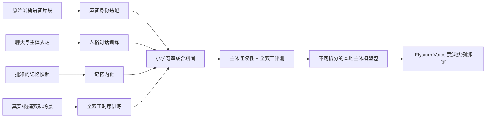

# 本地 Omni 实时全双工模型后训练计划

> 状态：待用户审批的技术方案，不代表已经授权下载模型、生成训练数据、占用 8×B300、启动训练或接入 Elysium。
> 调研基线：2026-08-04。模型、许可证和上游训练支持在开工前必须重新核对并固定版本。

本目录的主体定义以[主体模型、经历与自我解释](identity_and_self_interpretation.md)为准：获批权重是爱莉的个体核心与主要意识承载体，`SOUL.md` 是她拥有的自我解释，Life Event/Memory 保存可审计生活史；三者不能再混称为一份“人格配置”。

## 1. 结论

本计划建议把目标拆成两个可验收阶段，而不是一次性训练一个同时承担中文理解、音视频感知、全双工时序、工具调用和固定音色的模型：

1. **第一阶段：音频原生全双工。** 模型在同一生成循环中持续听取用户语音并生成自己的文本/语音，自己决定何时保持沉默、开始说话、停止、处理插话和恢复回答。前置 VAD 可以用于降噪、保护和评测，但不能替模型做轮次决策。
2. **第二阶段：Omni 扩展。** 在第一阶段稳定后再加入视觉或其他感知条件。Elysium 现有的 Perception/World State 仍是可信运行时边界；主体模型可以承载人格、声音和截至明确截止点的凝练记忆，但私有场景上下文、当前工具权限和新发生事件仍由运行时绑定。

首选研究底座仍是 **BayLing-Duplex / GLM-4-Voice 9B**，前提是先通过许可证、中文实机能力、可复现训练和目标声音适配四个门。它的多通道交错序列直接建模“用户语音 + 助手内在文本 + 助手语音”，公开论文用 400K 全双工样本进行 SFT，再用只改变时序的 DPO 偏好对优化轮次和打断。若其 speech decoder 无法用原始片段稳定训练成爱莉声音，或无法把人格/记忆训练结果打包成单一主体模型 artifact，就失去主线资格，不能只靠外置 TTS 冒充目标完成。

同时保留两条对照线：

- **PersonaPlex 7B / Moshi**：真正的双音频流、成熟的实时服务和公开后训练经验，尤其适合验证目标声音适配与真实对话节律如何解耦；主要缺点是公开底座以英语为主。
- **Qwen3-Omni-30B-A3B-Instruct**：作为本地语义教师、音频理解基准和离线评审模型，不作为第一阶段全双工学生底座。它具有低延迟流式 Thinker–Talker，但公开技术报告没有原生同时听说或打断时序的双通道训练定义。

MiniCPM-o 4.5 可作为未来音视频 Omni 的短期可行性实验，但不应在验证其全双工训练链、中文稳定性和主体模型训练链前直接承担主线。

## 2. 原始片段能训练声音，但不能单独训练场景

用户已有的爱莉原始语音片段应成为目标声音的首选权威素材，不需要先经过 TTS。即使只有孤立片段，也可以用于：

- speech decoder、声码器、speaker embedding 或 voice adapter 的音色适配；
- 发音、韵律、情绪、口癖、呼吸和声学风格学习；
- 本地 ASR 转写、forced alignment 后建立文本—目标声音监督；
- 评测目标音色相似度、可懂度与音素覆盖。

但孤立片段没有另一方的输入、绝对时间轴和交互结果，不能教会模型何时接话、何时继续听、如何处理抢话和双方重叠。训练因此拆成四个数据域：原始声音负责 `voice_identity`，聊天记录负责 `persona_dialogue`，批准的主体历史负责 `consolidated_memory`，真实或明确构造的双轨时间线负责 `duplex_timing`。最终用小学习率联合巩固连接四者。

TTS 从主数据源降为可选增强：可以生成多样化用户轨、补齐稀缺音素或构造压力场景，但目标助手音色默认优先使用原始片段。所有合成内容必须显式标记，不得冒充真实经历。

## 3. 目标架构

批准后的本地模型负责承载爱莉的稳定人格、声音、凝练记忆、语音理解、回复内容、交流时序和语音 token 生成。Elysium 继续负责激活可信 `ConsciousnessInstance`、绑定当前感知与新记忆、覆盖工具权限和身份、维护事件账本及进程生命周期。Voice Omni 是同一主体的一个意识实例；主体模型权重与运行时生活史共同维持连续性，不建立第二套人格。

## 4. 8×B300 定位

如果设备是 DGX/HGX B300，官方规格为 8×288 GB HBM3e（合计约 2.3 TB）、NVSwitch 全互连；DGX B300 还提供 8×3.84 TB 本地 NVMe。对 9B 级全双工模型，显存不是首要风险，数据质量、音频预处理吞吐、长序列负载均衡、恢复能力和评测可信度更重要。

建议：

- 第一个可复现基线使用 BF16；只有 BF16 与 FP8 在固定样本上达到损失、梯度和输出等价门后才启用 Transformer Engine FP8。
- 10K 样本烟雾训练可以用 LoRA 验证人格/记忆/时序数据；声音阶段必须单独验证 speech decoder 或 voice adapter。生产候选应比较可合并 adapter 与全量微调的差异，最终锁定不可拆分的主体模型包。
- 全量训练使用 8 卡单节点 `torchrun`，优先 FSDP2 或 DeepSpeed ZeRO-2/3；不把单卡能放下模型误当成可恢复、可扩展的工业训练方案。
- 不承诺训练耗时。先跑 1% burn-in，依据真实 samples/s、codec 预处理速度和 checkpoint 时间计算成本。

## 5. 里程碑与审批点

| Gate | 交付物 | 用户审批后才能做的下一步 |
|---|---|---|
| G0 | 模型/代码许可证、原始声音授权、主体数据范围与隐私清单 | 导入受限权重和批准的数据快照 |
| G1 | 候选的本地中文全双工零训练报告、目标声音/主体训练链静态审计 | 保留最多两个可训练候选 |
| G2 | 1K 分域数据契约与 10K 声音/人格/记忆/时序烟雾训练 | 确定唯一主底座并扩到 50K 消融 |
| G3 | 50K 的 V/P/M/D 配比、原始/增强音频和联合巩固 A/B | 扩到 200K/400K SFT |
| G4 | 可恢复的全量 SFT、固定离线评测集 | 构造并运行时序 DPO |
| G5 | DPO 候选、盲测、长时稳定和安全评测 | 导出本地推理候选 |
| G6 | 与现有 Voice Provider 契约的影子接入 | 用户手动启动 Elysium 做真实链路验收 |

任何 Gate 未通过都保留数据、配置、日志和 checkpoint，不用“继续堆数据/算力”掩盖失败。

## 6. 本目录

- [主体模型、经历与自我解释](identity_and_self_interpretation.md)
- [模型选择与技术判断](model_selection.md)
- [数据与原始声音生产线](data_pipeline.md)
- [训练平台与 8×B300 方案](training_infra.md)
- [评测、发布门与审批清单](evaluation_and_approval.md)
- [本地意识承载模型后训练规范](../../architecture/本地意识承载模型后训练规范.md)
- [一手资料索引](sources.md)

## 7. 审批前不执行的动作

- 不下载或转换 BayLing、GLM-4-Voice、PersonaPlex、Moshi、Qwen3-Omni 权重。
- 不读取、导出或复制用户的原始语音片段；不导出聊天、`SOUL.md`、`USER.md`、`MEMORY.md`、日记、Life Event 或真实通话内容，直到用户批准准确数据范围与快照规则。
- 不启动音频预处理或可选 TTS 增强，不占用 B300，不创建训练集。
- 不修改 `plugins/voice_live/`，不启动、停止或重启 Elysium。
- 不把外部实验跟踪、日志或训练样本发送到云端。
