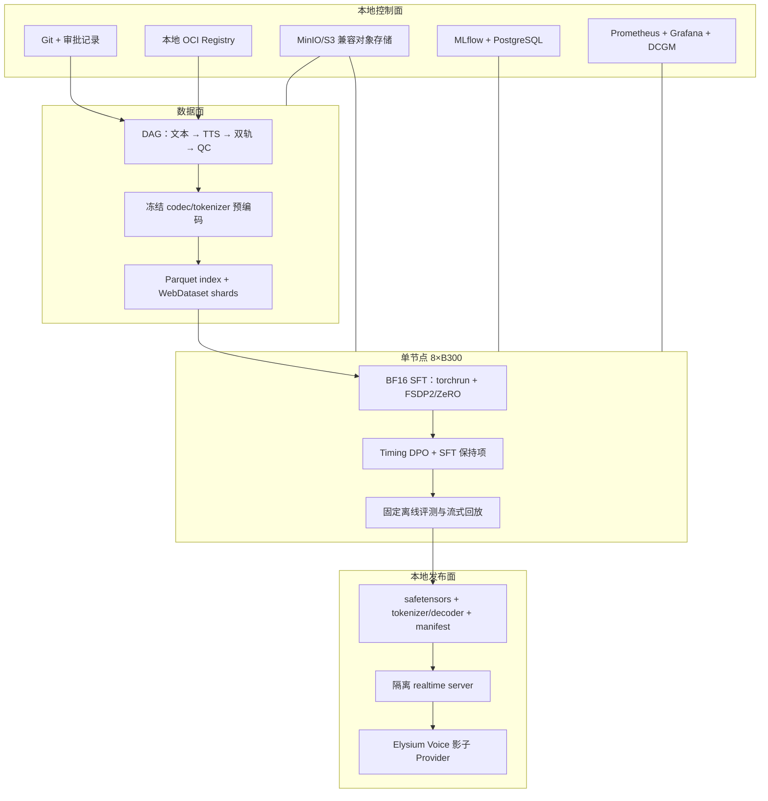

# 工业级训练平台与 8×B300 方案

## 1. 目标

训练平台必须做到：一条命令可重放、数据和模型完全本地、8 卡故障后可恢复、每个产物可追溯、训练与评测严格隔离、checkpoint 可验证、失败不覆盖历史、推理包能回到与训练相同的 tokenizer/decoder revision。

本计划只定义未来实现，不在审批前创建训练服务、容器、数据库或 B300 作业。

## 2. 总体分层



这些产品是建议的可替换实现，不是必须引入的品牌依赖。关键契约是：本地、版本化、内容寻址、可恢复和可审计。

## 3. 仓库与产物边界

未来代码建议单独放在仓库顶层 `training/omni_duplex/`，不与 `plugins/voice_live/` 的生产运行时混写：

```text
training/omni_duplex/
  configs/          # 不可变实验配置模板
  data/             # schema、builder、QC、sharder；不含真实数据
  models/           # BayLing/Moshi 适配与 weighted loss
  train/            # SFT/DPO 入口、checkpoint、resume
  eval/             # 离线、流式、人工评测导出
  serving/          # 候选 realtime server，不启动 Elysium
  tests/            # schema、对齐、loss、恢复、导出契约
```

大权重、数据、运行日志、MLflow artifact、数据库和 checkpoint 全部在 Git 外。Git 只保存 schema、配置、代码、模型卡、数据卡和内容 hash。

## 4. 8×B300 资源策略

NVIDIA 官方 DGX B300 规格为 8×288 GB HBM3e（2.3 TB）、72 PFLOPS FP8 训练、第五代 NVLink/NVSwitch；DGX 机型还有 8×3.84 TB cache NVMe。9B 模型可以在单卡 BF16 放下，但工业训练仍要利用全节点吞吐与分片恢复。

### 4.1 作业类型

| 作业 | GPU | 说明 |
|---|---:|---|
| TTS/codec 离线生成 | 1–8 | 根据各引擎可扩展性分片；产物完成后释放 GPU |
| 1K/10K smoke | 1–2 | 先验证 loss、resume、导出，不占满全节点 |
| 50K 数据 A/B | 8 | 等预算并行实验按时间串行，避免共享 I/O 干扰 |
| 200K/400K SFT | 8 | 单节点全卡、独占 NVLink 域 |
| Timing DPO | 8 或实测缩小 | 参考模型与策略模型显存开销更高，先测 ZeRO/FSDP |
| 固定评测 | 1–2 | 与训练错峰；评测进程不复用训练状态 |
| Qwen3-Omni 教师 | 2–4 起步 | 以 vLLM 实测为准，不能和主训练争用同一显存/端口 |

### 4.2 并行与显存

- 先用 DDP/BF16 建立数值参考；正式长序列训练优先 FSDP2 `FULL_SHARD`/`HYBRID_SHARD` 或 DeepSpeed ZeRO-2/3。
- speech tokenizer 和 decoder 在 BayLing SFT 中冻结并离线预编码，避免 8 个 rank 重复做确定性音频编码。
- 按有效 token/音频秒做动态长度桶与全局 batch 平衡；不能只按样本数平均，否则长对话 rank 会拖住全局 step。
- gradient accumulation 只用于达到目标全局 audio-seconds/tokens，不用它隐藏单 rank OOM。
- 激活检查点、FlashAttention、fused optimizer 分别做消融并固定版本；发现 NaN 时先回到 BF16 参考。

### 4.3 精度策略

1. BF16 是首个可审计基线，保留 FP32 optimizer state/关键归一化。
2. FP8 只在同一 1K 固定集上通过：损失曲线、梯度范数、100-step 权重差、生成 token 和离线分数容差后启用。
3. Transformer Engine recipe、缩放策略和版本写入 run manifest；不写“fp8=true”这种不可重放的模糊配置。
4. FP4 只用于未来推理实验，不作为本计划的训练默认。

## 5. 训练实现

### 5.1 SFT

BayLing 方案需要自定义 multi-channel collator：

- 按 `N:M:N` 交错用户 speech、助手 text/state、助手 speech；
- 用户 speech 和 padding 不计算目标损失；
- 文本与助手 speech 计算交叉熵；
- `[SILENCE]`、`[ASSISTANT]`、`[EPAD]` 使用显式权重；
- 训练日志分开报告 text、speech、silence、role token loss，不能只有总 loss；
- batch 内校验通道 token 类型、因果 shift、两轨长度和内容 hash。

先使用论文的一个 epoch、batch 32、peak LR `1e-5` 作为复现起点，不把它直接宣布为中文最优。10K/50K 阶段比较 LoRA 与全量 9B LLM 微调；speech tokenizer/decoder 默认冻结。

### 5.2 Timing DPO

- 参考模型固定为 G4 SFT checkpoint；
- 正负样本内容 hash 必须一致；
- DPO 与正例 SFT loss 同时记录；
- 首个复现从论文的 200 steps、peak LR `3e-7`、`beta=0.5`、SFT 系数 `0.5` 开始；
- 发现内容/音色下降时停止，不用继续训练期待自行恢复。

### 5.3 工具控制通道

工具调用放在文本控制通道，不让 speech decoder朗读 JSON。训练样本同时包含：

- 自然语音确认或等待语；
- 严格 schema 的工具请求 token；
- 带 generation/occurrence 的工具结果；
- 结果回注后的继续回答；
- 超时、拒绝、幂等重试和取消。

模型只提出工具意图；Elysium 运行时继续覆盖可信 scene/instance/episode 身份并执行授权。工具训练不得绕过现有 `VoiceToolBroker`。

## 6. 数据读取与 I/O

- 权威索引用 Parquet，波形/预计算 token 用约 0.5–2 GB 的 WebDataset tar shards；每个 shard 有独立 SHA-256 和样本数/音频秒统计。
- node-local NVMe 保存当前 epoch 热集；对象存储保存不可变数据 revision 和 checkpoint。缓存损坏只重建缓存。
- dataloader 以音频秒为成本做 bucket，并输出 rank 间长度偏差；I/O wait、decode time、host-to-device time 都纳入指标。
- 预计算 token 包含 tokenizer checkpoint hash。tokenizer 变化必须创建新 L4 revision，禁止混用旧 token。
- 训练前进行全 shard scan；训练中发现坏样本立即失败并报告 sample id，不跳过后继续改变数据分布。

## 7. 运行、跟踪与复现

每个 run 写入不可变 `run_manifest.json`：

- Git SHA、dirty=false 证明、容器 digest、Python/PyTorch/CUDA/NCCL/driver/Transformer Engine 版本；
- 基础权重、tokenizer、decoder、TTS、数据 revision 的 SHA-256；
- 完整解析后的训练配置和所有 seed；
- 8 张 GPU UUID、NVLink 拓扑、主机内核、CPU/内存/NVMe 信息；
- world size、并行策略、精度 recipe、全局 batch/audio-seconds；
- checkpoint 继承链和审批 Gate。

MLflow 只保存指标和脱敏 artifact 引用；音频正文、私有对话、token、密钥不进入 tags。监控至少包括：

- tokens/s、audio-seconds/s、MFU（若可计算）、step time P50/P95；
- GPU utilization、HBM、温度、功率、ECC、NVLink、CPU/RAM、NVMe I/O；
- 总 loss 与分通道 loss、grad norm、LR、NaN/Inf、skipped steps；
- dataloader queue、坏样本、长度不均衡；
- checkpoint 写入/校验/恢复耗时。

## 8. Checkpoint 与恢复

- checkpoint 先写临时目录，所有 rank 完成后生成 manifest/hash，再原子发布为 `complete`。
- 同时保存 model、optimizer、scheduler、scaler/FP8 state、sampler position、RNG 和数据 cursor。
- 每次正式训练至少做一次“训练 N 步 → 终止 → 另一进程恢复 → 与不中断对照”测试。
- latest 只是指针；历史 checkpoint 不覆盖。损坏或缺 rank 的 checkpoint 不进入候选列表。
- checkpoint 完成后复制到独立故障域并做 hash 复核；只有本机 NVMe 的单份文件不算备份。
- 保留 best、last、Gate milestone 和发生异常前的最后一个健康 checkpoint；其余按审批过的保留策略清理。

## 9. 供应链与安全

- 上游仓库、容器、模型权重按 commit/tag/digest 固定；生成 SBOM，扫描已知漏洞和 pickle/remote-code 风险。
- 权重首次下载在隔离区校验 hash、许可证和文件类型后进入本地模型仓库。
- 默认禁用外网 egress；依赖、镜像和权重通过批准的镜像源导入。
- 训练 secrets 使用本地 secret store/挂载文件，只传名称或文件描述符，不进入命令行、环境快照和日志。
- 训练节点不直接挂载 Elysium 正式 runtime 数据。需要批准样本时使用一次性、只读、内容寻址的数据导出。

## 10. 推理导出

候选包必须包含：

```text
model.safetensors shards
tokenizer + added state tokens
speech tokenizer revision
speech decoder revision
generation config
realtime protocol/schema version
model card + data card + license bundle
run/data/checkpoint manifests
offline eval report + known limitations
```

导出后在全新容器中从零加载，复验固定 token 和固定音频输出。候选 server 先作为隔离本地进程运行，具备 health/readiness、限流、会话 owner、超时、取消、KV cache 上限和旧音频 generation 清理。只有 G6 才由 Voice owner 按现有 Provider 契约接入；不会自动启动或重启 Elysium。

## 11. 成本估算方法

不从 H100/A100 公开数字直接外推 B300 完成时间。G2 的 1% burn-in 记录：

```text
训练 GPU 小时 = 目标有效 audio-seconds / 实测 audio-seconds-per-second / 3600 × GPU 数
数据 GPU 小时 = TTS 小时 / TTS 实测 RTF × 使用 GPU 数
checkpoint 预算 = 单次完整 checkpoint 时间 × 计划次数
存储预算 = 权威音频 + 派生版本 + checkpoint + 备份 + 30% 临时空间
```

PersonaPlex 公开的 8×A100、约 2,250 小时合成对话、24,576 steps、约 6 小时训练只能作为“该规模有实践先例”的参考，不能作为本项目工期承诺。
